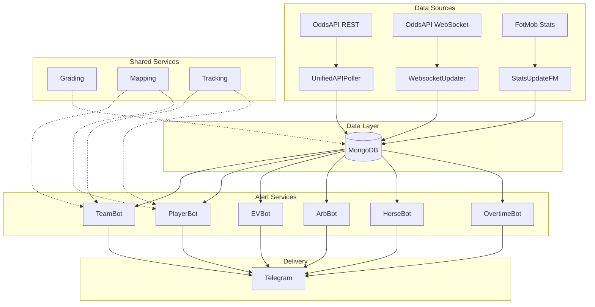

## Overview

PROPPR is a microservices-based betting intelligence platform that monitors real-time betting markets, calculates expected value, detects arbitrage opportunities, and delivers personalized alerts via Telegram.

<Note>
  The platform processes odds from 100+ bookmakers across 50+ sports, generating thousands of alerts daily for value bets, arbitrage, and player props.
</Note>

---

## Architecture Diagram



---

## Data Flow

The PROPPR data pipeline follows this sequence:

<Steps>
  <Step title="External Data Collection">
    **Three parallel data streams** continuously fetch market data:

    1. **UnifiedAPIPoller** polls REST API every 60 seconds
    2. **WebsocketUpdater** receives real-time odds via WebSocket
    3. **StatsUpdateFM** fetches player/team stats from FotMob

    From `UnifiedAPIPoller/runners/run_unified_poller.py:28`:
    ```python
    def main():
        """Start the Unified API Poller"""
        logger.info("PROPPR Unified API Poller Starting")
        from PROPPR.UnifiedAPIPoller.core.unified_poller import main as poller_main
        poller_main()
    ```
  </Step>

  <Step title="Data Normalization">
    Raw data is normalized through **SharedServices** modules:

    - **LeagueNormalizer**: Standardizes league names across sources
    - **MarketMapper**: Maps markets to canonical format
    - **FixtureMatching**: Matches games across different APIs

    From `SharedServices/mapping/league_normalizer.py:4`:
    ```python
    class LeagueNormalizer:
        """
        Centralized service for normalizing league names to prevent duplicates
        caused by data source inconsistencies.
        """
        LEAGUE_NORMALIZATION_MAP = {
            "LaLiga": "La Liga",
            "Liga Portugal": "Primeira Liga",
            "UEFA Conference League": "Europa Conference League",
            # ... 50+ mappings
        }
    ```
  </Step>

  <Step title="MongoDB Storage">
    Normalized data is stored in **MongoDB collections**:

    | Collection | Purpose | Updated By |
    |------------|---------|------------|
    | `all_positive_alerts` | Player prop opportunities | UnifiedAPIPoller |
    | `all_positive_team_alerts` | Team market opportunities | UnifiedAPIPoller |
    | `cerebro_positive_alerts` | EV bets (Pinnacle-based) | EVBot scanner |
    | `arbitrage_bets` | Cross-bookmaker arbs | ArbBot scanner |
    | `horse_racing_arbs` | Horse racing value bets | HorseBot scanner |
    | `user_tracked_bets` | User bet tracking | BetTrackingSystem |

    From `config/settings.py:20`:
    ```python
    COLLECTIONS = {
        'player_alerts': 'all_positive_alerts',
        'team_alerts': 'all_positive_team_alerts',
        'cerebro_alerts': 'cerebro_positive_alerts',
        'arbitrage_bets': 'arbitrage_bets',
        'user_tracked_bets': 'user_tracked_bets',
    }
    ```
  </Step>

  <Step title="Alert Processing">
    **Alert bots** query MongoDB and apply user filters:

    - Minimum/maximum odds thresholds
    - League preferences (Main leagues vs. all)
    - Market selections (goals, assists, corners, etc.)
    - Time-to-kickoff requirements
    - Bookmaker preferences

    Each bot maintains a **sent alerts cache** to prevent duplicates.
  </Step>

  <Step title="Telegram Delivery">
    Formatted alerts are sent via **Telegram Bot API**:

    - Rich formatting with market emojis
    - Bookmaker deep links for one-click betting
    - Kelly criterion stake recommendations
    - Real-time odds updates on button clicks

    From `PropprTeamBot/core/bot/team_bot.py:42`:
    ```python
    from telegram.ext import (
        Updater, CommandHandler, CallbackQueryHandler,
        MessageHandler, Filters, CallbackContext
    )
    
    # Import shared services
    from PROPPR.SharedServices.tracking import BetTrackingSystem
    from PROPPR.SharedServices.mapping import MarketResultMapper
    from PROPPR.SharedServices.grading.processors import ImmediateBetGrader
    ```
  </Step>

  <Step title="Result Grading">
    **Grading services** update bet outcomes:

    - Poll FotMob API for match results
    - Calculate win/loss for tracked bets
    - Update Google Sheets with P&L
    - Send result notifications to users

    From `SharedServices/grading/processors/immediate_bet_grader.py:23`:
    ```python
    class ImmediateBetGrader:
        """Service for grading bets immediately when fixture is finished"""
        
        def __init__(self, api_token: str = '', bot_type: str = 'player'):
            self.bot_type = bot_type
            self.fotmob = get_fotmob_service()
    ```
  </Step>
</Steps>

---

## Alert Bots

PROPPR includes **6 specialized alert bots**, each monitoring different market types:

<CardGroup cols={2}>
  <Card title="PropprTeamBot" icon="users">
    **Team Market Alerts**
    
    Monitors team-level betting markets:
    - Goals (Over/Under, Both Teams to Score)
    - Corners (Total, Asian Handicap)
    - Cards (Yellow, Red, Bookings)
    - Shots (Total, On Target)
    - Fouls, Offsides, Possession

    Runner: `PropprTeamBot/runners/run_team_bot.py`
  </Card>

  <Card title="PropprPlayerBot" icon="user">
    **Player Prop Alerts**
    
    Monitors individual player markets:
    - Goals, Assists, Goal Contributions
    - Shots, Shots on Target
    - Passes, Key Passes, Long Balls
    - Tackles, Interceptions, Duels
    - Dribbles, Crosses, Touches

    Runner: `PropprPlayerBot/runners/run_player_bot.py`
  </Card>

  <Card title="PropprEVBot" icon="chart-line">
    **Expected Value Alerts**
    
    Calculates EV using Pinnacle as sharp reference:
    - Compares soft bookmaker odds to Pinnacle
    - Filters by minimum EV% (configurable)
    - Kelly criterion stake sizing
    - Line movement tracking

    From `PropprEVBot/core/bot/ev_bot.py:40`:
    ```python
    # Import request tracker for API rate limiting
    from PROPPR.SharedServices.tracking import get_tracker, KEY_MAIN
    main_request_tracker = get_tracker(KEY_MAIN)
    ```

    Runner: `PropprEVBot/core/bot/ev_bot.py`
  </Card>

  <Card title="PropprArbBot" icon="scale-balanced">
    **Arbitrage Detection**
    
    Scans for guaranteed profit opportunities:
    - Cross-bookmaker arbitrage
    - Automatic stake calculation
    - Exchange commission handling
    - Sharp bookmaker filtering

    From `PropprArbBot/core/bot/arb_bot.py:30`:
    ```python
    from PROPPR.PropprArbBot.services.database.database import DatabaseManager
    from PROPPR.PropprArbBot.services.api.api_service import ArbitrageAPIService
    from PROPPR.PropprArbBot.core.scanner.db_odds_arbitrage_scanner import DBOddsArbitrageScanner
    ```

    Runner: `PropprArbBot/core/bot/arb_bot.py`
  </Card>

  <Card title="PropprHorseBot" icon="horse">
    **Horse Racing Alerts**
    
    UK horse racing value bets:
    - Win/Place markets
    - Value detection vs. market consensus
    - Daily summaries with results
    - Time-windowed alerts (configurable)

    From `PropprHorseBot/core/bot/horse_bot.py:23`:
    ```python
    from PROPPR.PropprHorseBot.services.database.connection import HorseBotDatabase
    from PROPPR.PropprHorseBot.core.horse_alert_formatter import HorseAlertFormatter
    from PROPPR.PropprHorseBot.core.filters.filters import HorseRacingFilter
    ```

    Runner: `PropprHorseBot/core/bot/horse_bot.py`
  </Card>

  <Card title="OvertimeBot" icon="ethereum">
    **Blockchain Betting**
    
    Automated betting on Optimism chain:
    - Overtime Markets protocol integration
    - Wallet management (encrypted keys)
    - Automatic bet placement
    - Gas optimization

    From `OvertimeBot/core/bot/overtime_bot.py:69`:
    ```python
    from PROPPR.OvertimeBot.services.alerts import OvertimeAlertProcessor, OvertimeBetPlacer
    from PROPPR.OvertimeBot.services.blockchain import OvertimeContractService, OvertimeWalletService
    ```

    Runner: `OvertimeBot/core/bot/overtime_bot.py`
  </Card>
</CardGroup>

---

## Data Services

Three core services populate MongoDB with real-time market data:

### WebsocketUpdater

**Real-time odds via WebSocket connections**

Maintains persistent WebSocket connections to odds providers for instant updates:

- **Connection Management**: Auto-reconnect on disconnect
- **Rate Limiting**: Respects provider limits
- **Data Validation**: Filters invalid/stale data
- **MongoDB Updates**: Upserts odds with timestamps

From `WebsocketUpdater/runners/run_websocket_updater.py:28`:
```python
def main():
    """Start the WebSocket updater"""
    logger.info("PROPPR WebSocket Updater Starting")
    from PROPPR.WebsocketUpdater.core.websocket_updater import main as ws_main
    ws_main()
```

**Configuration**: `WebsocketUpdater/config/`

---

### UnifiedAPIPoller

**REST API polling at regular intervals**

Polls multiple odds APIs on a schedule (default: 60 seconds):

- **Multi-source**: Supports OddsAPI, custom feeds
- **Rate Limiting**: Managed via RequestTracker
- **Transformation**: Normalizes to unified format
- **Matching**: Deduplicates across sources

From `UnifiedAPIPoller/runners/run_unified_poller.py:28`:
```python
def main():
    """Start the Unified API Poller"""
    logger.info("PROPPR Unified API Poller Starting")
    from PROPPR.UnifiedAPIPoller.core.unified_poller import main as poller_main
    poller_main()
```

**Key Configuration** (from `config/settings.py:36`):
```python
POLLING_INTERVAL = 60  # seconds
DEFAULT_GRADING_INTERVAL = 60  # seconds
```

---

### StatsUpdateFM

**Player/team statistics pipeline**

Fetches detailed stats from FotMob for predictive models:

- **Fixtures**: Upcoming matches with lineups
- **Player Stats**: Goals, assists, xG, shot accuracy
- **Team Stats**: Possession, corners, cards
- **Projections**: Predicted player output

From `StatsUpdateFM/runners/run_stats_pipeline.py:28`:
```python
def main():
    """Start the Stats Pipeline"""
    logger.info("StatsUpdateFM Pipeline Starting")
    from PROPPR.StatsUpdateFM.core.pipeline.stats_update import main as pipeline_main
    pipeline_main()
```

**FotMob Service** (from `SharedServices/api/fotmob_service.py:30`):
```python
class FotMobAPIService:
    """Service for interacting with FotMob API"""
    
    BASE_URL = "https://www.fotmob.com/api"
    DEFAULT_HEADERS = {
        'User-Agent': 'Mozilla/5.0 ...',
        'Accept': 'application/json',
    }
```

---

## SharedServices Modules

Shared utilities used across all bots:

<AccordionGroup>
  <Accordion title="Grading System">
    **Unified bet result grading**

    Location: `SharedServices/grading/`

    - **ImmediateBetGrader**: Grades finished fixtures on-demand
    - **Scheduler**: Periodic grading jobs for pending bets
    - **Processors**: Market-specific result calculation

    From `SharedServices/grading/processors/immediate_bet_grader.py:23`:
    ```python
    class ImmediateBetGrader:
        """Service for grading bets immediately when fixture is finished"""
        
        def __init__(self, api_token: str = '', bot_type: str = 'player'):
            self.bot_type = bot_type
            self.fotmob = get_fotmob_service()
        
        def is_fixture_finished(self, fixture_data: Dict) -> bool:
            """Check if fixture has finished (FotMob format)"""
            is_finished = self.fotmob.is_fixture_finished(fixture_data)
            return is_finished
    ```

    **Grading Flow**:
    1. Query MongoDB for ungraded bets
    2. Fetch fixture results from FotMob
    3. Apply market-specific grading logic
    4. Update bet status (Won/Lost/Push)
    5. Calculate profit/loss
    6. Sync to Google Sheets
  </Accordion>

  <Accordion title="Mapping Services">
    **Data normalization and entity matching**

    Location: `SharedServices/mapping/`

    **LeagueNormalizer** (`league_normalizer.py:4`):
    ```python
    class LeagueNormalizer:
        """
        Centralized service for normalizing league names
        """
        LEAGUE_NORMALIZATION_MAP = {
            "LaLiga": "La Liga",
            "Liga Portugal": "Primeira Liga",
            # ... 50+ variations
        }
    ```

    **MarketMapper** (`market_mapper.py`):
    - Maps bookmaker market names to canonical format
    - Handles regional variations (US vs. EU odds)
    - Normalizes player/team names

    **FixtureMatchingUtils** (`fixture_matching_utils.py`):
    - Fuzzy matching for team names
    - Kickoff time comparison
    - Cross-source fixture linking

    **CanonicalMarkets** (`canonical_markets.py`):
    - Defines standard market types
    - Validation rules for each market
    - Conversion factors (Asian lines, etc.)
  </Accordion>

  <Accordion title="Tracking System">
    **User bet tracking and reconstruction**

    Location: `SharedServices/tracking/`

    **BetTrackingSystem** (`bet_tracking_system.py`):
    ```python
    from PROPPR.SharedServices.tracking import BetTrackingSystem
    
    # Track a user's bet
    tracker = BetTrackingSystem(mongo_client, db_name)
    tracker.track_bet(
        user_id=123456,
        fixture_id="12345",
        market="Goals",
        selection="Over 2.5",
        odds=2.10,
        stake=10.00
    )
    ```

    **AlertReconstructionService** (`alert_reconstruction_service.py`):
    - Rebuilds alert data from message IDs
    - Links tracked bets to original alerts
    - Handles edited/deleted messages

    **RequestTracker** (`request_tracker.py`):
    - API rate limit management
    - Per-key quota tracking
    - Automatic key rotation

    From `SharedServices/tracking/request_tracker.py`:
    ```python
    from PROPPR.SharedServices.tracking import get_tracker, KEY_MAIN
    
    tracker = get_tracker(KEY_MAIN)
    if tracker.can_make_request():
        # Make API call
        tracker.record_request()
    ```
  </Accordion>

  <Accordion title="Configuration & Presets">
    **Centralized bot configuration**

    Location: `SharedServices/config/`

    - **shared_config.py**: MongoDB, API keys, defaults
    - **presets.py**: Optimal market presets per bot

    From `config/credentials.py:143`:
    ```python
    def get_mongo_connection_string() -> str:
        """
        Get MongoDB connection string based on environment.
        Production (Linux): Uses local MongoDB on Hetzner
        Development (Mac): Uses Atlas or SSH tunnel
        """
        if is_production():
            return _get_env('MONGODB_URI_PRODUCTION', default="mongodb://127.0.0.1:27017/...")
        else:
            return _get_env('MONGODB_URI_DEVELOPMENT', default="mongodb://127.0.0.1:27017/...")
    ```
  </Accordion>

  <Accordion title="API Clients">
    **Reusable API service wrappers**

    Location: `SharedServices/api/`

    **FotMobService** (`fotmob_service.py:30`):
    ```python
    class FotMobAPIService:
        """Service for interacting with FotMob API"""
        BASE_URL = "https://www.fotmob.com/api"
        
        def get_fixture_details(self, fixture_id: int) -> Dict:
            """Get detailed fixture data including lineups and stats"""
        
        def get_player_stats(self, player_id: int) -> Dict:
            """Get player career and season statistics"""
        
        def is_fixture_finished(self, fixture_data: Dict) -> bool:
            """Check if a fixture has finished"""
    ```

    **OddsAPIClient** (used by UnifiedAPIPoller):
    - REST endpoint calls
    - Response parsing
    - Error handling
  </Accordion>

  <Accordion title="i18n (Internationalization)">
    **Multi-language support**

    Location: `SharedServices/i18n/`

    From `SharedServices/__init__.py:20`:
    ```python
    from PROPPR.SharedServices.i18n import t, SUPPORTED_LANGUAGES
    
    # Usage in bots
    welcome_message = t('welcome_message', lang=user_lang)
    ```

    **Supported Languages**: English, Spanish, Portuguese, French, German
  </Accordion>

  <Accordion title="Utilities">
    **Text normalization and helpers**

    Location: `SharedServices/utils/`

    - **text_normalization.py**: Unicode handling, accent removal
    - **bookmaker_link_generator.py**: Deep link creation

    From `SharedServices/__init__.py:19`:
    ```python
    from PROPPR.SharedServices.utils import comprehensive_normalize_text
    
    # Normalize player names for matching
    normalized = comprehensive_normalize_text("Cristiano Ronaldo")
    ```
  </Accordion>
</AccordionGroup>

---

## Deployment Architecture

PROPPR runs on a **Hetzner dedicated server** with systemd service management:

### Production Environment

**Server**: Ubuntu 22.04 LTS on Hetzner (46.224.85.158)

**Directory Structure**:
```
/opt/proppr/
├── config/                    # Credentials and settings
│   ├── credentials.py
│   └── settings.py
├── SharedServices/            # Shared modules
├── PropprTeamBot/             # Team bot service
├── PropprPlayerBot/           # Player bot service
├── PropprEVBot/               # EV bot service
├── PropprArbBot/              # Arb bot service
├── PropprHorseBot/            # Horse bot service
├── OvertimeBot/               # Overtime bot service
├── WebsocketUpdater/          # WebSocket data service
├── UnifiedAPIPoller/          # API polling service
├── StatsUpdateFM/             # Stats pipeline
├── .env                       # Environment variables (sensitive)
├── credentials.json           # Google Sheets service account (sensitive)
└── turnstile_cookies.json     # FotMob cookies (sensitive)
```

### Systemd Services

Each bot runs as a systemd unit:

```ini team-bot.service
[Unit]
Description=PROPPR Team Bot
After=network.target mongodb.service

[Service]
Type=simple
User=root
WorkingDirectory=/opt/proppr
ExecStart=/usr/bin/python3 -m PROPPR.PropprTeamBot.runners.run_team_bot
Restart=always
RestartSec=10

[Install]
WantedBy=multi-user.target
```

**Service Management**:
```bash
# Start/stop services
systemctl start team-bot
systemctl stop team-bot
systemctl restart team-bot

# View status
systemctl status team-bot

# View logs
journalctl -u team-bot -f

# List all PROPPR services
systemctl list-units 'proppr-*'
```

### Deployment Process

From `scripts/deploy/push_and_restart.sh:1`:
```bash
#!/bin/bash
# PROPPR Deployment Script
SERVER="46.224.85.158"
PROPPR_LOCAL="/Users/zinq/PycharmProjects/Cerebro/PROPPR"
PROPPR_REMOTE="/opt/proppr"

# Sync files to server
rsync -avz --exclude '__pycache__' --exclude '*.pyc' \
    "$PROPPR_LOCAL/" root@$SERVER:"$PROPPR_REMOTE/"

# Restart services
ssh root@$SERVER "systemctl restart proppr-*"
```

**Deploy Workflow**:
<Steps>
  <Step title="Push Code">
    Sync updated code to production server:
    ```bash
    ./scripts/deploy/push_and_restart.sh
    ```
  </Step>

  <Step title="Service Selection">
    Choose which services to restart:
    - Individual bot (Team, Player, EV, etc.)
    - Data services (WebSocket, Poller, Stats)
    - All services
  </Step>

  <Step title="Automatic Restart">
    Script automatically restarts selected systemd units:
    ```bash
    ssh root@server "systemctl restart team-bot"
    ```
  </Step>

  <Step title="Verify Deployment">
    Check logs to ensure services started:
    ```bash
    ssh root@server "journalctl -u team-bot -n 50"
    ```
  </Step>
</Steps>

---

## MongoDB Schema

Key collections and document structures:

### Player Alerts (`all_positive_alerts`)

```json
{
  "_id": ObjectId("..."),
  "fixture_id": "12345",
  "league": "Premier League",
  "home_team": "Arsenal",
  "away_team": "Chelsea",
  "kickoff_time": ISODate("2026-03-05T15:00:00Z"),
  "player_name": "Bukayo Saka",
  "market": "Shots On Target",
  "line": 2.5,
  "selection": "Over",
  "odds": 2.10,
  "bookmaker": "Bet365",
  "expected_value": 8.5,
  "timestamp": ISODate("2026-03-04T10:30:00Z")
}
```

### Team Alerts (`all_positive_team_alerts`)

```json
{
  "_id": ObjectId("..."),
  "fixture_id": "12345",
  "league": "La Liga",
  "home_team": "Barcelona",
  "away_team": "Real Madrid",
  "kickoff_time": ISODate("2026-03-05T20:00:00Z"),
  "market": "Total Corners",
  "line": 10.5,
  "selection": "Over",
  "odds": 1.95,
  "bookmaker": "Betfair",
  "timestamp": ISODate("2026-03-04T11:00:00Z")
}
```

### Arbitrage Bets (`arbitrage_bets`)

```json
{
  "_id": ObjectId("..."),
  "fixture_id": "12345",
  "league": "Bundesliga",
  "home_team": "Bayern Munich",
  "away_team": "Borussia Dortmund",
  "kickoff_time": ISODate("2026-03-05T17:30:00Z"),
  "market": "Match Result",
  "legs": [
    {
      "selection": "Bayern Munich",
      "odds": 1.75,
      "bookmaker": "Bet365",
      "stake": 57.14
    },
    {
      "selection": "Draw or Dortmund",
      "odds": 2.40,
      "bookmaker": "Pinnacle",
      "stake": 42.86
    }
  ],
  "margin": 2.5,  // 2.5% guaranteed profit
  "total_stake": 100.00,
  "guaranteed_profit": 2.50,
  "timestamp": ISODate("2026-03-04T12:00:00Z")
}
```

### Tracked Bets (`user_tracked_bets`)

```json
{
  "_id": ObjectId("..."),
  "user_id": 123456789,
  "fixture_id": "12345",
  "player_name": "Erling Haaland",
  "market": "Anytime Goalscorer",
  "selection": "Yes",
  "odds": 1.80,
  "stake": 10.00,
  "bookmaker": "Bet365",
  "status": "pending",  // pending | won | lost | void
  "result": null,
  "profit_loss": null,
  "tracked_at": ISODate("2026-03-04T13:00:00Z"),
  "graded_at": null
}
```

---

## Performance Characteristics

<CardGroup cols={2}>
  <Card title="Throughput" icon="gauge-high">
    - **Odds Updates**: 1,000+ per minute (WebSocket)
    - **API Polls**: 60-second intervals
    - **Alerts Sent**: 500+ per hour peak
    - **Database Queries**: 10,000+ per hour
  </Card>

  <Card title="Latency" icon="clock">
    - **WebSocket Update → MongoDB**: &lt;100ms
    - **Alert Detection → Telegram**: &lt;2 seconds
    - **User Command → Response**: &lt;500ms
    - **Grading Check**: Every 60 seconds
  </Card>

  <Card title="Reliability" icon="shield-check">
    - **Uptime**: 99.5% (systemd auto-restart)
    - **Data Freshness**: &lt;1 minute
    - **Duplicate Prevention**: 99.9%
    - **Rate Limit Compliance**: 100%
  </Card>

  <Card title="Scalability" icon="arrow-up-right-dots">
    - **Concurrent Users**: 1,000+
    - **Active Subscriptions**: 5,000+
    - **MongoDB Storage**: 100GB+
    - **Daily Alerts**: 10,000+
  </Card>
</CardGroup>

---

## Next Steps

<CardGroup cols={2}>
  <Card title="Quickstart" icon="rocket" href="/quickstart">
    Get PROPPR running locally in 10 minutes
  </Card>
  <Card title="Development" icon="code" href="/development/local-setup">
    Contributing guide and code structure
  </Card>
  <Card title="API Reference" icon="book" href="/api/bot-interface">
    Complete API documentation for all modules
  </Card>
  <Card title="Deployment" icon="server" href="/deployment/setup">
    Production deployment and monitoring
  </Card>
</CardGroup>
