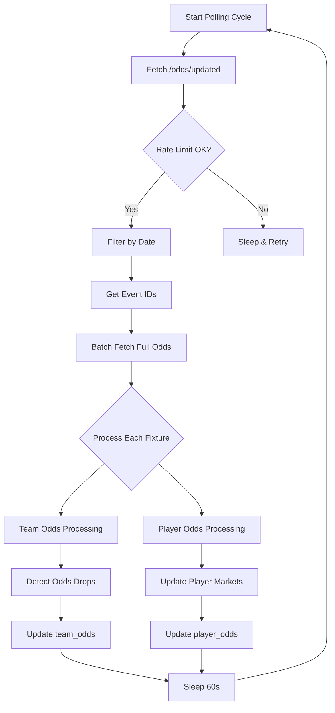

## Overview

The Unified API Poller polls the Odds API `/v3/odds/updated` endpoint every 60 seconds to fetch recent odds changes and update MongoDB collections for both team and player bots.

<Info>
The poller shares a **5000 requests/hour** quota with the WebSocket Updater and uses a global rate tracker to coordinate API usage.
</Info>

## Architecture

### UnifiedAPIPoller Class

```python Core Structure
class UnifiedAPIPoller:
    def __init__(self):
        # MongoDB Collections
        self.team_odds_collection
        self.player_odds_collection
        self.exchange_liquidity_collection
        self.arbitrage_bets_collection
        
        # Additional Integrations
        self.overtime_client  # Overtime Markets
        self.betpanda_client  # BetPanda
        self.jackbit_client   # Jackbit
        self.oddschecker_client  # OddsChecker
        
        # Rate Limiting
        self.request_tracker  # Global rate tracker
```

**Source:** `/UnifiedAPIPoller/core/unified_poller.py`

## Polling Flow



## Key Features

### 1. Rate-Limited Polling

<CodeGroup>
```python Rate Limit Check
def fetch_updated_odds(self, lookback_seconds: int = 50):
    """
    Fetch updated odds with rate limit protection.
    """
    # Check global rate tracker
    if self.request_tracker:
        if not self.request_tracker.can_make_request():
            logger.warning("Rate limit reached, skipping cycle")
            return [], {}
        self.request_tracker.record_request()
    
    # Calculate since timestamp (max 60s lookback)
    current_time = int(time.time())
    since = current_time - min(lookback_seconds, 50)
    
    url = f"https://api.odds-api.io/v3/odds/updated"
    params = {
        'apiKey': self.api_key,
        'since': since,
        'bookmaker': 'Bet365',
        'sport': 'Football'
    }
    
    response = requests.get(url, params=params, timeout=30)
    return response.json(), response.headers
```
</CodeGroup>

<Warning>
The API enforces a **maximum 60-second lookback** window. Requests with older `since` values will be rejected.
</Warning>

### 2. Date Filtering

<Accordion title="Filter Logic">
```python Date Range Filter
def filter_events_by_date(self, events: List[Dict]) -> List[Dict]:
    """
    Filter events to only those within next 14 days.
    Excludes games starting in <3 minutes.
    """
    now = datetime.now(timezone.utc)
    min_date = now + timedelta(minutes=3)
    max_date = now + timedelta(days=14)
    
    filtered = []
    for event in events:
        event_date = datetime.fromisoformat(
            event.get('date').replace('Z', '+00:00')
        )
        
        if min_date <= event_date <= max_date:
            filtered.append(event)
    
    return filtered
```

**Rationale:**
- **3-minute buffer:** Prevents betting on games already starting
- **14-day window:** Focuses on relevant upcoming fixtures
</Accordion>

### 3. Batch Processing

<CardGroup cols={2}>
  <Card title="Batch Size" icon="layer-group">
    10 events per API call
  </Card>
  <Card title="Bookmakers" icon="book">
    Bet365, Polymarket, M88, FB Sports, Betfair Exchange, Kambi, Vbet
  </Card>
</CardGroup>

```python Batch Fetching
def get_full_odds_for_events(self, event_ids: List[int]) -> List[Dict]:
    """
    Fetch full odds data for multiple events in batches.
    """
    batch_size = 10
    all_odds_data = []
    
    for i in range(0, len(event_ids), batch_size):
        batch_ids = event_ids[i:i + batch_size]
        
        # Filter V2 IDs (deprecated)
        v3_ids = [id for id in batch_ids if not str(id).startswith('1')]
        
        url = "https://api.odds-api.io/v3/odds/multi"
        params = {
            'apiKey': self.api_key,
            'eventIds': ','.join(str(id) for id in v3_ids),
            'bookmakers': 'Bet365,M88,FB Sports,Betfair Exchange'
        }
        
        response = requests.get(url, params=params, timeout=30)
        all_odds_data.extend(response.json())
    
    return all_odds_data
```

### 4. Odds Drop Detection

<Accordion title="Team Odds Drops">
```python Drop Detection (≥1%)
def _detect_team_odds_drops(self, existing_bookmakers, new_bookmakers, existing_doc):
    """
    Detect odds drops ≥1% in team markets.
    Logs changes to updates array.
    """
    drops = []
    
    for bookmaker_name, new_markets in new_bookmakers.items():
        existing_markets = existing_bookmakers.get(bookmaker_name, [])
        
        # Build lookup for existing markets
        existing_lookup = {}
        for market in existing_markets:
            market_name = market.get('name', '')
            for odds_entry in market.get('odds', []):
                hdp = odds_entry.get('hdp', 'NA')
                for direction in ['home', 'away', 'over', 'under']:
                    odds_str = odds_entry.get(direction)
                    if odds_str:
                        key = f"{market_name}|{direction}|{hdp}"
                        existing_lookup[key] = float(odds_str)
        
        # Compare new markets
        for market in new_markets:
            for odds_entry in market.get('odds', []):
                hdp = odds_entry.get('hdp', 'NA')
                for direction in ['home', 'away', 'over', 'under']:
                    new_odds_str = odds_entry.get(direction)
                    if not new_odds_str:
                        continue
                    
                    try:
                        new_odds = float(new_odds_str)
                        key = f"{market.get('name')}|{direction}|{hdp}"
                        old_odds = existing_lookup.get(key)
                        
                        if old_odds:
                            # Calculate drop percentage
                            drop_pct = ((old_odds - new_odds) / old_odds) * 100
                            
                            if drop_pct >= 1.0:  # 1% threshold
                                drops.append({
                                    'bookmaker': bookmaker_name,
                                    'market': market.get('name'),
                                    'direction': direction,
                                    'hdp': hdp,
                                    'old_odds': old_odds,
                                    'new_odds': new_odds,
                                    'drop_pct': round(drop_pct, 2)
                                })
                    except (ValueError, TypeError):
                        continue
    
    return drops
```

**Update Logging:**
```python
if drops:
    team_odds_collection.update_one(
        {'id': fixture_id},
        {'$push': {
            'updates': {
                '$each': [{'timestamp': now, 'changes': drops}],
                '$slice': -10  # Keep last 10 updates
            }
        }}
    )
```
</Accordion>

## Market Filtering

### Team Markets

<Tabs>
  <Tab title="Core Markets">
    - ML / Moneyline / 1X2
    - Totals / Goals Over/Under
    - Spread / Asian Handicap
    - Both Teams To Score (BTTS)
    - Double Chance
    - Draw No Bet
  </Tab>
  
  <Tab title="Team Props">
    - Team Total Home/Away
    - Corners Totals
    - Total Cards
    - Team Shots
    - Team Shots on Target
    - Goalkeeper Saves
    - Clean Sheet
  </Tab>
  
  <Tab title="Cerebro Markets">
    - Correct Score
    - Halftime/Fulltime
    - Half Time Result
    - Total Home/Away Goals
  </Tab>
</Tabs>

```python Team Market Filter
TEAM_MARKET_NAMES = {
    'ML', 'Moneyline', 'Match Result', '1X2', 'Full Time Result',
    'Totals', 'Goals Over/Under', 'Total Goals',
    'Spread', 'Asian Handicap', 'Handicap',
    'Both Teams to Score', 'BTTS',
    'Corners Totals', 'Total Corners',
    'Total Cards', 'Asian Total Cards',
    'Team Shots Home', 'Team Shots Away',
    'Team Shots On Target Home', 'Team Shots On Target Away',
    'Goalkeeper Saves Home', 'Goalkeeper Saves Away',
    # ... (full list in source)
}

filtered_bookmakers = {}
for bookmaker_name, markets in bookmakers.items():
    team_markets = [m for m in markets if m.get('name') in TEAM_MARKET_NAMES]
    if team_markets:
        filtered_bookmakers[bookmaker_name] = team_markets
```

### Player Markets

<Accordion title="Player Market Filtering">
Player markets are filtered separately in the Player Odds Manager:

```python
PLAYER_MARKET_NAMES = {
    'Player Shots', 'Player Shots on Target',
    'Player Goals', 'Player Assists',
    'Player Tackles', 'Player Passes',
    'Player Fouls', 'Player Cards',
    # ... (40+ player markets)
}
```

See [Player Bot Documentation](/bots/player-bot) for complete list.
</Accordion>

## Special Bookmaker Integrations

### Overtime Markets

<CardGroup cols={2}>
  <Card title="Polling Interval" icon="clock">
    30 seconds (configurable)
  </Card>
  <Card title="Collections" icon="database">
    `overtime_odds`, `overtime_mappings`
  </Card>
</CardGroup>

```python Overtime Integration
if OVERTIME_ENABLED and self.overtime_client:
    # Fetch Overtime markets
    overtime_markets = self.overtime_client.fetch_live_markets()
    
    # Transform to standard format
    transformed = self.overtime_transformer.transform_markets(overtime_markets)
    
    # Match with team_odds via overtime_mappings
    for market in transformed:
        mapping = overtime_mappings_collection.find_one({
            'odds_api_fixture_id': market['fixture_id']
        })
        
        if mapping:
            overtime_fixture_id = mapping['overtime_fixture_id']
            # Update overtime_odds collection
```

### Crypto Bookmakers

<Tabs>
  <Tab title="Jackbit">
    - Web3 bookmaker
    - Soccer, Basketball, Tennis
    - Polls every 30s
    - Updates `team_odds.bookmakers.Jackbit`
  </Tab>
  
  <Tab title="BetPanda">
    - Crypto sportsbook
    - Major leagues only
    - Polls every 30s
    - Updates `team_odds.bookmakers.BetPanda`
  </Tab>
</Tabs>

### OddsChecker Scraper

<Warning>
OddsChecker integration uses Selenium for web scraping (slow). Disabled by default.
</Warning>

```python OddsChecker Config
ODDSCHECKER_ENABLED = False  # Default: disabled
ODDSCHECKER_POLL_INTERVAL = 300  # 5 minutes
ODDSCHECKER_HEADLESS = True  # Headless browser
```

## Document Structure

### team_odds Schema

<CodeGroup>
```json team_odds Document
{
  "id": 61234567,
  "home": "Manchester City",
  "away": "Arsenal",
  "league": "Premier League",
  "country": "England",
  "date": "2026-03-15T15:00:00Z",
  
  "bookmakers": {
    "Bet365": [
      {
        "name": "ML",
        "odds": [{
          "home": 1.85,
          "away": 2.10,
          "draw": 3.40
        }]
      },
      {
        "name": "Totals",
        "odds": [{
          "over": 1.90,
          "under": 1.95,
          "line": 2.5
        }]
      }
    ],
    "M88": [...],
    "Betfair Exchange": [...]
  },
  
  "bookmakers_initial": { /* Initial odds snapshot */ },
  
  "updates": [
    {
      "timestamp": "2026-03-15T14:30:00Z",
      "changes": [
        {
          "bookmaker": "Bet365",
          "market": "ML",
          "direction": "home",
          "old_odds": 1.90,
          "new_odds": 1.85,
          "drop_pct": 2.63
        }
      ]
    }
  ],
  
  "created_at": "2026-03-10T12:00:00Z",
  "last_updated": "2026-03-15T14:30:00Z",
  "last_api_sync": "2026-03-15T14:30:15Z",
  
  "home_normalized": "manchester city",
  "away_normalized": "arsenal",
  "league_normalized": "premier league"
}
```
</CodeGroup>

## Running the Poller

### Manual Start

```bash
python /opt/PROPPR/UnifiedAPIPoller/runners/run_unified_poller.py
```

### Systemd Service

<CodeGroup>
```ini proppr-api-poller.service
[Unit]
Description=PROPPR Unified API Poller
After=network.target mongod.service

[Service]
Type=simple
User=proppr
WorkingDirectory=/opt/PROPPR
ExecStart=/usr/bin/python3 /opt/PROPPR/UnifiedAPIPoller/runners/run_unified_poller.py
Restart=always
RestartSec=60

[Install]
WantedBy=multi-user.target
```
</CodeGroup>

## Performance & Monitoring

### Statistics Tracking

```python Stats Object
stats = {
    'total_polls': 0,
    'total_fixtures_processed': 0,
    'team_docs_created': 0,
    'team_docs_updated': 0,
    'player_docs_created': 0,
    'player_docs_updated': 0,
    'api_errors': 0,
    'overtime_polls': 0,
    'crypto_polls': 0,
    'oddschecker_polls': 0
}
```

### Performance Metrics

| Metric | Value |
|--------|-------|
| **Polling Interval** | 60 seconds |
| **Batch Size** | 10 events/call |
| **Processing Time** | &lt;5s for 100 fixtures |
| **API Calls/Cycle** | 2-15 (depends on updates) |

## Troubleshooting

<AccordionGroup>
  <Accordion title="Rate limit errors (429)">
    **Symptoms:** `Too Many Requests` errors in logs
    
    **Solutions:**
    - Check `global_request_tracker` usage
    - Reduce polling frequency
    - Disable optional integrations (OddsChecker, crypto bookmakers)
  </Accordion>
  
  <Accordion title="'since' parameter too old">
    **Error:** `400 Bad Request - since parameter too old`
    
    **Solution:** API enforces 60s max lookback. Poller auto-retries with suggested timestamp.
  </Accordion>
  
  <Accordion title="Missing special bookmakers">
    **Issue:** Overtime/Jackbit odds not appearing
    
    **Fix:** Special bookmakers are preserved during updates:
    ```python
    special_bookmakers = ['Overtime', 'Jackbit', 'BetPanda']
    for bm in special_bookmakers:
        if bm in existing_bookmakers and bm not in new_bookmakers:
            new_bookmakers[bm] = existing_bookmakers[bm]
    ```
  </Accordion>
</AccordionGroup>

## Configuration

### Environment Variables

```bash
# MongoDB
MONGO_CONNECTION_STRING="mongodb://localhost:27017"
MONGO_DATABASE="proppr"

# Odds API
ODDS_API_KEY="your_api_key_here"

# Polling
POLLING_INTERVAL=60  # seconds
BATCH_SIZE=10
LOOKBACK_SECONDS=50

# Optional Integrations
OVERTIME_ENABLED=true
OVERTIME_POLL_INTERVAL=30

CRYPTO_ODDS_ENABLED=true
JACKBIT_ENABLED=true
BETPANDA_ENABLED=true

ODDSCHECKER_ENABLED=false
ODDSCHECKER_POLL_INTERVAL=300
```

## Related Documentation

<CardGroup cols={3}>
  <Card title="WebSocket Updater" icon="globe" href="/data/websocket-updater">
    Real-time odds updates
  </Card>
  <Card title="Team Bot" icon="users" href="/bots/team-bot">
    Team market processing
  </Card>
  <Card title="Player Bot" icon="user" href="/bots/player-bot">
    Player market processing
  </Card>
</CardGroup>