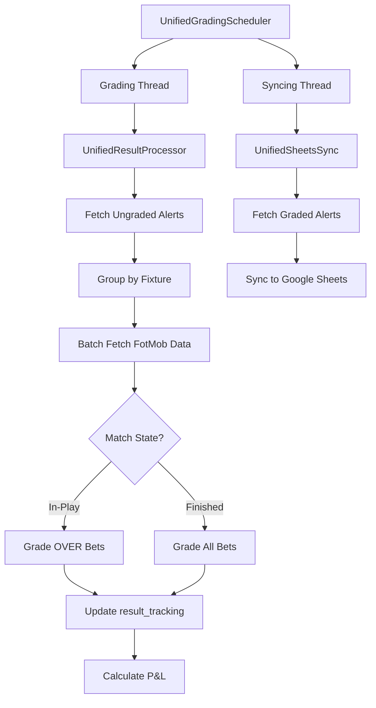

## Overview

The Grading System automatically grades tracked bets by fetching live fixture results from FotMob, comparing actual stats to bet thresholds, and calculating profit/loss.

<Info>
Supports **OVER bets grading during live matches** and full grading when fixtures finish.
</Info>

## Architecture



**Source:** `/SharedServices/grading/`

## Core Components

### UnifiedGradingScheduler

<Accordion title="Scheduler Class" defaultOpen>
```python Scheduler Initialization
class UnifiedGradingScheduler:
    def __init__(self, mongo_uri, db_name, api_token, bot_type='player'):
        # Initialize processors
        self.result_processor = UnifiedResultProcessor(
            mongo_uri=mongo_uri,
            database_name=db_name,
            api_token=api_token,  # Deprecated (kept for compatibility)
            bot_type=bot_type
        )
        
        self.sheets_sync = UnifiedSheetsSync(
            credentials_path=credentials_path,
            spreadsheet_name=spreadsheet_name,
            bot_type=bot_type,
            collection=self.result_processor.collection
        )
        
        # Adaptive scheduling
        self.grading_interval = 120  # 2 minutes default
        self.sync_interval = 60      # 1 minute
        
        # Threads
        self.grading_thread = threading.Thread(target=self._grading_loop)
        self.sync_thread = threading.Thread(target=self._syncing_loop)
```

**Adaptive Intervals:**
- Grading: 60s - 600s (adjusts based on API rate limits)
- Syncing: 60s (fixed)
</Accordion>

### UnifiedResultProcessor

<Accordion title="Result Processor">
**Responsibilities:**
- Query ungraded alerts from MongoDB
- Fetch fixture details from FotMob
- Extract player/team stats
- Calculate bet results (won/lost/refund)
- Update `result_tracking` field

**Key Methods:**
```python
class UnifiedResultProcessor:
    def get_ungraded_alerts(self) -> List[Dict]:
        """Fetch alerts pending grading"""
        
    def batch_fetch_fixtures(self, fixture_ids: List[str]) -> Dict:
        """Fetch FotMob data for multiple fixtures"""
        
    def grade_player_alert(self, alert: Dict, fixture_data: Dict) -> Dict:
        """Grade player prop bet"""
        
    def grade_team_alert(self, alert: Dict, fixture_data: Dict) -> Dict:
        """Grade team bet"""
        
    def process_all_alerts(self) -> int:
        """Main grading loop"""
```
</Accordion>

## Grading Flow

### 1. Fetch Ungraded Alerts

<CodeGroup>
```python Query Logic
def get_ungraded_alerts(self) -> List[Dict]:
    """
    Find alerts that need grading.
    """
    cutoff_time = datetime.utcnow() - timedelta(minutes=5)
    
    query = {
        '$and': [
            # Not yet graded
            {'$or': [
                {'result_tracking.result_status': 'pending'},
                {'result_tracking': {'$exists': False}}
            ]},
            
            # Match has started (5 min buffer)
            {'$or': [
                {'Date': {'$lte': cutoff_time.strftime('%Y-%m-%d')}},
                {'fixture_datetime': {'$lt': cutoff_time}}
            ]},
            
            # Not marked untrackable
            {'result_tracking.stat_type': {'$ne': 'untrackable'}},
            
            # Has fixture ID
            {'fixture_id': {'$nin': [None, '', 0]}}
        ],
        
        # Bot-specific filters
        **self.config['filter']  # e.g., {'is_player_alert': True}
    }
    
    return list(self.collection.find(query).limit(500))
```
</CodeGroup>

### 2. Group by Fixture

<Warning>
Batching fixtures reduces API calls (FotMob has no multi-fixture endpoint, but we can cache smartly).
</Warning>

```python Grouping
def group_alerts_by_fixture(self, alerts: List[Dict]) -> Dict[str, List[Dict]]:
    grouped = {}
    for alert in alerts:
        fixture_id = str(alert.get('fixture_id', ''))
        if not fixture_id or fixture_id == 'None':
            fixture_id = str(alert.get('fixture_info', {}).get('match_id', ''))
        
        if fixture_id:
            if fixture_id not in grouped:
                grouped[fixture_id] = []
            grouped[fixture_id].append(alert)
    
    return grouped
```

### 3. Fetch Fixture Details

<Accordion title="FotMob Data Fetching">
```python Batch Fetch with Caching
def batch_fetch_fixtures(self, fixture_ids: List[str]) -> Dict[str, Dict]:
    """
    Fetch FotMob data for multiple fixtures.
    Uses cache (fixture_api_cache_fm) to minimize API calls.
    """
    all_fixtures = {}
    
    for fixture_id in fixture_ids:
        # Check cache first
        cached = self._get_cached_fixture_details(fixture_id)
        if cached:
            all_fixtures[fixture_id] = cached
            continue
        
        # Fetch from FotMob API
        try:
            details = self.fotmob.get_fixture_details(int(fixture_id))
            if details:
                all_fixtures[fixture_id] = details
                
                # Cache result
                self.fixture_api_cache_fm.update_one(
                    {'match_id': str(fixture_id)},
                    {'$set': {'data': details, 'cached_at': datetime.now()}},
                    upsert=True
                )
        except Exception as e:
            logger.error(f"Error fetching fixture {fixture_id}: {e}")
            
            # Try fixture ID resolution (mapping collections)
            resolved_id = self._lookup_fotmob_fixture_id_from_mappings(
                alert=None,
                failed_fixture_id=fixture_id
            )
            
            if resolved_id and resolved_id != fixture_id:
                # Retry with resolved ID
                details = self.fotmob.get_fixture_details(int(resolved_id))
                if details:
                    all_fixtures[fixture_id] = details
    
    return all_fixtures
```

**Cache Collections:**
- `fixture_api_cache_fm` (current season)
- `fixture_api_cache_fm_prev_season` (previous season)
</Accordion>

### 4. Check Match State

<CodeGroup>
```python Match State Detection
def get_fixture_state(self, fixture_id: str) -> Tuple[int, bool, bool]:
    """
    Get fixture state from FotMob.
    
    Returns:
        (state_id, is_inplay, is_finished)
    """
    match_data = self._get_fixture_details_with_cache(fixture_id)
    
    if not match_data:
        return None, False, False
    
    is_finished = self.fotmob.is_fixture_finished(match_data)
    
    status = match_data.get('header', {}).get('status', {})
    started = status.get('started')
    cancelled = status.get('cancelled')
    
    is_inplay = started and not is_finished and not cancelled
    
    # Map to state_id (SportMonks legacy)
    if is_finished:
        state_id = 5  # Finished
    elif is_inplay:
        state_id = 2  # In-play
    elif cancelled:
        state_id = 9  # Cancelled
    else:
        state_id = 1  # Not started
    
    return state_id, is_inplay, is_finished
```
</CodeGroup>

### 5. Filter Gradeable Alerts

<Info>
**OVER bets:** Graded during live matches (can win early)  
**UNDER bets:** Only graded when match finishes  
**HANDICAP bets:** Only graded when match finishes
</Info>

```python Filtering Logic
def filter_gradeable_alerts(self, alerts: List[Dict], is_inplay: bool, is_finished: bool) -> List[Dict]:
    gradeable = []
    
    for alert in alerts:
        market_direction = alert.get('market_direction', '').lower()
        
        # OVER bets: Grade if in-play OR finished
        if market_direction == 'over' and (is_inplay or is_finished):
            gradeable.append(alert)
        
        # UNDER bets: Grade only if finished
        elif market_direction == 'under' and is_finished:
            gradeable.append(alert)
        
        # HANDICAP bets (Home/Away): Grade only if finished
        elif market_direction in ['home', 'away'] and is_finished:
            gradeable.append(alert)
    
    return gradeable
```

### 6. Extract Stats & Grade

<Tabs>
  <Tab title="Player Stats">
    ```python
    def extract_player_stat_value(self, fixture_id, player_id, stat_type, fixture_data):
        """
        Extract player stat from FotMob lineup data.
        """
        # Get player stats from FotMob service
        player_stats = self.fotmob.get_player_stats(fixture_data, str(player_id))
        
        if not player_stats:
            return 0
        
        # Map stat type to FotMob key
        stat_key = STAT_ID_MAPPING.get(type_id, stat_type)
        
        # Special handling for binary stats
        if stat_key == 'first_goalscorer':
            first_scorer_id = self.fotmob.get_first_goalscorer_id(fixture_data)
            return 1 if str(first_scorer_id) == str(player_id) else 0
        
        # Get value
        value = player_stats.get(stat_key, 0)
        
        return float(value)
    ```
    
    **Stat Mapping:**
    ```python
    STAT_ID_MAPPING = {
        52: 'goals',
        34: 'corners',
        84: 'yellow_cards',
        42: 'shots',
        86: 'shots_on_target',
        78: 'tackles',
        51: 'offsides',
        56: 'fouls',
        80: 'passes',
        100: 'interceptions'
    }
    ```
  </Tab>
  
  <Tab title="Team Stats">
    ```python
    def extract_team_stat_value(self, fixture_data, team_name, stat_type):
        """
        Extract team stat from FotMob match data.
        """
        team_stats = self.fotmob.get_team_stats(fixture_data, team_name)
        
        if not team_stats:
            return 0
        
        stats = team_stats.get('stats', {})
        stat_key = STAT_ID_MAPPING.get(type_id, stat_type)
        
        value = stats.get(stat_key, 0)
        return float(value)
    ```
  </Tab>
  
  <Tab title="Result Markets">
    ```python
    def calculate_result_market_value(self, fixture_data, location, market_direction):
        """
        Calculate result for result markets (ML, DNB, DC, BTTS, HT).
        
        Args:
            location: result_1x2, result_dnb, result_dc, result_ht, result_btts
            market_direction: 'Home', 'Draw', 'Away', 'Yes', 'No', etc.
        
        Returns:
            'won', 'lost', or 'refund'
        """
        # Extract scores
        use_halftime = (location == 'result_ht')
        home_score, away_score = self.extract_scores_from_fixture(
            fixture_data,
            use_halftime
        )
        
        # Match Result (1X2)
        if location == 'result_1x2':
            if home_score > away_score:
                return 'won' if market_direction == 'Home' else 'lost'
            elif away_score > home_score:
                return 'won' if market_direction == 'Away' else 'lost'
            else:
                return 'won' if market_direction == 'Draw' else 'lost'
        
        # Draw No Bet
        elif location == 'result_dnb':
            if home_score == away_score:
                return 'refund'
            elif home_score > away_score:
                return 'won' if market_direction == 'Home' else 'lost'
            else:
                return 'won' if market_direction == 'Away' else 'lost'
        
        # Both Teams To Score
        elif location == 'result_btts':
            both_scored = (home_score > 0 and away_score > 0)
            if market_direction in ['Yes', 'Y']:
                return 'won' if both_scored else 'lost'
            else:
                return 'won' if not both_scored else 'lost'
    ```
  </Tab>
</Tabs>

### 7. Determine Result

<CodeGroup>
```python Result Determination
def determine_result(self, actual_value: float, threshold: float, direction: str) -> str:
    """
    Compare actual stat to threshold.
    
    Returns:
        'won', 'lost', 'refund', 'half_win', 'half_loss'
    """
    if direction.lower() == 'over':
        if actual_value > threshold:
            return 'won'
        elif actual_value == threshold:
            return 'refund'  # Push
        else:
            return 'lost'
    
    else:  # under
        if actual_value < threshold:
            return 'won'
        elif actual_value == threshold:
            return 'refund'
        else:
            return 'lost'
```
</CodeGroup>

### 8. Calculate P&L

<Accordion title="Profit/Loss Calculation">
```python P&L Logic
def calculate_returns(self, bet_doc: Dict, result_status: str) -> Dict:
    """
    Calculate returns and profit/loss based on result.
    """
    stake = bet_doc.get('actual_stake', 0.0)
    units_staked = bet_doc.get('units_staked', stake)
    odds = bet_doc.get('odds', 1.0)
    
    if result_status == 'won':
        returns = units_staked * odds
        profit_loss = returns - units_staked
    
    elif result_status == 'refund':
        returns = units_staked
        profit_loss = 0.0
    
    elif result_status == 'half_win':
        # Asian handicap half win
        returns = (units_staked / 2) * odds + (units_staked / 2)
        profit_loss = returns - units_staked
    
    elif result_status == 'half_loss':
        # Asian handicap half loss
        returns = units_staked / 2
        profit_loss = returns - units_staked
    
    else:  # lost
        returns = 0.0
        profit_loss = -units_staked
    
    bet_doc['status'] = result_status
    bet_doc['returns'] = returns
    bet_doc['profit_loss'] = profit_loss
    bet_doc['settled_at'] = datetime.now(timezone.utc)
    
    return bet_doc
```

**Example:**
```python
# WON bet
stake = 10.0
odds = 2.50
returns = 10.0 * 2.50 = 25.0
profit_loss = 25.0 - 10.0 = +15.0

# LOST bet
returns = 0.0
profit_loss = 0.0 - 10.0 = -10.0

# REFUND
returns = 10.0
profit_loss = 10.0 - 10.0 = 0.0
```
</Accordion>

### 9. Update result_tracking

<CodeGroup>
```python Update Alert Document
# Update alert with grading result
self.collection.update_one(
    {'_id': alert['_id']},
    {'$set': {
        'result_tracking': {
            'result_status': result_status,  # 'won', 'lost', 'refund'
            'actual_value': actual_value,
            'graded_at': datetime.now(timezone.utc),
            'fixture_state': 'finished',
            'stat_type': stat_type,
            'profit_loss': profit_loss,
            'returns': returns
        }
    }}
)
```
</CodeGroup>

## Special Cases

### Player Not in Squad

<Accordion title="Lineup Check & Refund">
```python Lineup Verification
def check_player_lineup_status(self, fixture_id, player_id, fixture_data):
    """
    Check if player started or was on bench.
    
    Returns:
        (should_refund, reason)
    """
    lineup = fixture_data.get('content', {}).get('lineup', {})
    
    if not lineup:
        return False, "unknown_lineup"
    
    # Check both teams
    for side in ['homeTeam', 'awayTeam']:
        # Check starters
        for player in lineup[side].get('starters', []):
            if str(player.get('id')) == str(player_id):
                return False, "started"  # Don't refund
        
        # Check bench
        for player in lineup[side].get('bench', []):
            if str(player.get('id')) == str(player_id):
                return True, "bench"  # Refund (didn't start)
    
    # Player not found in lineup at all
    return True, "not_in_lineup"
```

**Refund Handling:**
```python
should_refund, reason = self.check_player_lineup_status(
    fixture_id, player_id, fixture_data
)

if should_refund:
    alert['result_tracking'] = {
        'result_status': 'refund',
        'refund_reason': reason,
        'actual_value': None,
        'graded_at': datetime.now()
    }
```
</Accordion>

### Fixture ID Resolution

<Accordion title="Legacy ID Mapping">
**Problem:** Alerts may have SportMonks or Odds API IDs, but grader uses FotMob IDs.

**Solution:** Use mapping collections to resolve:

```python Fixture ID Lookup
def _lookup_fotmob_fixture_id_from_mappings(self, alert, failed_fixture_id):
    """
    Resolve FotMob fixture ID from legacy/odds IDs.
    """
    # Collect candidate IDs
    candidates = [
        failed_fixture_id,
        alert.get('fixture_id'),
        alert.get('odds_fixture_id'),
        alert.get('original_id')
    ]
    
    # Try team_fixture_mappings_fm
    mapping = self.team_fixture_mappings_fm.find_one({
        '$or': [
            {'odds_fixture_id': {'$in': candidates}},
            {'projection_fixture_id': {'$in': candidates}}
        ]
    })
    
    if mapping:
        fotmob_id = mapping.get('fotmob_fixture_id')
        logger.info(f"Resolved {failed_fixture_id} -> {fotmob_id}")
        return str(fotmob_id)
    
    # Try fixture_mappings_fm (legacy)
    mapping = self.fixture_mappings_fm.find_one({
        '$or': [
            {'odds_fixture_id': {'$in': candidates}},
            {'fotmob_fixture_id': {'$in': candidates}}
        ]
    })
    
    if mapping:
        return str(mapping.get('fotmob_fixture_id'))
    
    return None
```
</Accordion>

### Match Metadata Search

<Accordion title="Fallback Search by Team Names">
If fixture ID resolution fails, search by team names:

```python Team Name Search
def _find_correct_fixture_id(self, home_team: str, away_team: str, date_str: str) -> Optional[str]:
    """
    Search FotMob for fixture by team names and date.
    """
    # Calculate date range
    dt = datetime.fromisoformat(date_str.replace('Z', '+00:00'))
    start_date = (dt - timedelta(days=2)).strftime('%Y-%m-%d')
    end_date = (dt + timedelta(days=2)).strftime('%Y-%m-%d')
    
    # Sanitize team names
    clean_home = self._sanitize_team_name(home_team)
    clean_away = self._sanitize_team_name(away_team)
    
    # Search FotMob
    match_name = f"{clean_home} vs {clean_away}"
    fixtures = self.fotmob.search_fixture_by_name(match_name)
    
    # Filter by date
    for fixture in fixtures:
        fixture_date = fixture.get('matchDate', '')[:10]
        if start_date <= fixture_date <= end_date:
            # Verify opponent match
            if self._is_fuzzy_match(clean_away, fixture.get('awayTeamName')):
                return str(fixture['id'])
    
    return None
```
</Accordion>

## Google Sheets Sync

<CardGroup cols={2}>
  <Card title="Sheet Structure" icon="table">
    Columns: Date, Match, Player, Market, Threshold, Direction, Odds, Result, P/L
  </Card>
  <Card title="Sync Frequency" icon="clock">
    Every 60 seconds (rotation-based)
  </Card>
</CardGroup>

### Timestamp Rotation

<Accordion title="Rotation Logic">
**Problem:** Need to verify ALL graded alerts are in sheet (not just new ones).

**Solution:** Rotation-based syncing:

```python Rotation Sync
def run_sync_logic(self):
    """
    Rotate through graded alerts using 'last_sync_check' timestamp.
    """
    query = {
        'result_tracking.result_status': {'$nin': ['pending', None, '']},
        'result_tracking.stat_type': {'$ne': 'untrackable'},
        **self.config['filter']
    }
    
    # Sort by last_sync_check (oldest first)
    # Alerts never synced (null) come first
    graded_batch = list(self.collection.find(query)
        .sort('last_sync_check', ASCENDING)
        .limit(self.sync_batch_size)
    )
    
    if not graded_batch:
        return
    
    # Sync to sheet (deduplicates against current sheet content)
    synced_count = self.sheets_sync.sync_alerts(graded_batch)
    
    # Update last_sync_check for all processed alerts
    now = datetime.utcnow()
    alert_ids = [a['_id'] for a in graded_batch]
    self.collection.update_many(
        {'_id': {'$in': alert_ids}},
        {'$set': {'last_sync_check': now}}
    )
```

**Result:** Every alert gets checked eventually, ensuring no missing rows.
</Accordion>

## Running the Grader

### Manual Start

```bash
# Player Bot Grader
python /opt/PROPPR/SharedServices/grading/runners/run_grading_scheduler.py --bot-type player

# Team Bot Grader
python /opt/PROPPR/SharedServices/grading/runners/run_grading_scheduler.py --bot-type team

# Cerebro Bot Grader
python /opt/PROPPR/SharedServices/grading/runners/run_grading_scheduler.py --bot-type cerebro
```

### Systemd Services

<CodeGroup>
```ini proppr-player-grader.service
[Unit]
Description=PROPPR Player Bot Grader
After=network.target mongod.service

[Service]
Type=simple
User=proppr
WorkingDirectory=/opt/PROPPR
ExecStart=/usr/bin/python3 /opt/PROPPR/SharedServices/grading/runners/run_grading_scheduler.py --bot-type player
Restart=always
RestartSec=120

[Install]
WantedBy=multi-user.target
```

```ini proppr-team-grader.service
[Unit]
Description=PROPPR Team Bot Grader
After=network.target mongod.service

[Service]
Type=simple
User=proppr
WorkingDirectory=/opt/PROPPR
ExecStart=/usr/bin/python3 /opt/PROPPR/SharedServices/grading/runners/run_grading_scheduler.py --bot-type team
Restart=always
RestartSec=120

[Install]
WantedBy=multi-user.target
```
</CodeGroup>

## Performance Metrics

| Metric | Value |
|--------|-------|
| **Grading Cycle** | 120s (adaptive) |
| **Sync Cycle** | 60s (fixed) |
| **Alerts/Cycle** | 500 max |
| **Fixtures/Batch** | 50-100 |
| **Processing Time** | 30-60s per cycle |

## Troubleshooting

<AccordionGroup>
  <Accordion title="Alerts stuck in 'pending' state">
    **Symptoms:** Graded matches still show `result_status: 'pending'`
    
    **Solutions:**
    1. Check fixture ID is valid (not 0, null, or empty)
    2. Verify fixture exists in FotMob
    3. Check fixture has finished (5+ minute buffer)
    4. Review grader logs for errors
  </Accordion>
  
  <Accordion title="Player stats always 0">
    **Issue:** `actual_value: 0` for all player bets
    
    **Fixes:**
    - Verify `player_id` matches FotMob ID (not Odds API ID)
    - Check `player_mappings_fm` has correct mapping
    - Ensure fixture has lineup data in FotMob
    - Confirm stat type mapping is correct
  </Accordion>
  
  <Accordion title="Google Sheets sync missing rows">
    **Cause:** Sync deduplication too aggressive
    
    **Solution:** Rotation syncing ensures all alerts eventually checked.
    
    Force re-sync:
    ```python
    # Clear last_sync_check for all alerts
    collection.update_many(
        {},
        {'$unset': {'last_sync_check': ''}}
    )
    ```
  </Accordion>
  
  <Accordion title="Rate limit errors">
    **Symptoms:** `429 Too Many Requests` from FotMob
    
    **Solutions:**
    - Increase grading interval (adaptive backoff should handle this)
    - Reduce batch size (lower `BATCH_SIZE`)
    - Enable more aggressive caching
  </Accordion>
</AccordionGroup>

## Configuration

### Environment Variables

```bash
# MongoDB
MONGO_CONNECTION_STRING="mongodb://localhost:27017"
MONGO_DATABASE="proppr"

# FotMob
TURNSTILE_COOKIES_PATH="/opt/PROPPR/config/turnstile_cookies.json"

# Grading
GRADING_INTERVAL=120  # seconds (adaptive)
GRADING_ALERT_QUERY_LIMIT=500  # max alerts per cycle

# Syncing
SYNC_INTERVAL=60  # seconds
SYNC_BATCH_SIZE=100  # alerts per sync

# Google Sheets
GOOGLE_CREDENTIALS_PATH="/opt/PROPPR/config/credentials.json"
PLAYER_SHEET_KEY="1abc...xyz"  # From config
TEAM_SHEET_KEY="1def...uvw"    # From config
```

### Adaptive Scheduling Config

```python
# Grading interval bounds
MIN_GRADING_INTERVAL = 60   # 1 minute
MAX_GRADING_INTERVAL = 600  # 10 minutes
DEFAULT_GRADING_INTERVAL = 120  # 2 minutes

# Backoff on rate limit
BACKOFF_MULTIPLIER = 2.0

# Speed up after successes
SPEEDUP_AFTER_SUCCESSES = 5
SPEEDUP_DIVISOR = 2

# Batch sizing
DEFAULT_BATCH_SIZE = 100
RATE_LIMITED_BATCH_SIZE = 20
MAX_BATCH_SIZE = 500
```

## Related Documentation

<CardGroup cols={3}>
  <Card title="Stats Pipeline" icon="chart-line" href="/data/stats-update">
    Player projections & stats
  </Card>
  <Card title="Player Bot" icon="user" href="/bots/player-bot">
    Player prop alerts
  </Card>
  <Card title="Team Bot" icon="users" href="/bots/team-bot">
    Team market alerts
  </Card>
</CardGroup>