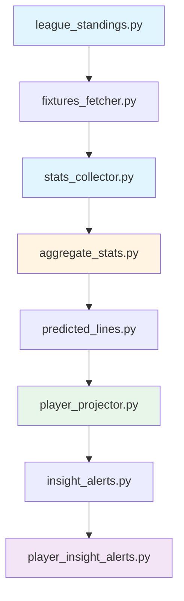

## Overview

The StatsUpdateFM pipeline collects soccer statistics from FotMob, aggregates player/team performance data, and generates player projections for betting markets.

<Info>
This pipeline replaced the legacy SportMonks-based system with a **FotMob-first approach** using HTML scraping as fallback when API is blocked.
</Info>

## Pipeline Architecture



**Source:** `/StatsUpdateFM/core/pipeline/stats_update.py`

## Pipeline Stages

### 1. League Standings

<Accordion title="league_standings.py">
**Purpose:** Fetch current league tables for all tracked leagues

**Collections Updated:**
- `league_standings_fm`

**Key Logic:**
```python
from PROPPR.StatsUpdateFM.core.pipeline.league_standings import fetch_standings

for league_id in TRACKED_LEAGUES:
    standings = fotmob_client.get_league(
        id=league_id,
        tab='table'
    )
    
    # Parse standings data
    teams = standings.get('table', [{}])[0].get('data', {}).get('table', {}).get('all', [])
    
    # Store in DB
    league_standings_fm.update_one(
        {'league_id': league_id},
        {'$set': {
            'teams': teams,
            'last_updated': datetime.now()
        }},
        upsert=True
    )
```

**Output Fields:**
- Position, Played, Won, Drawn, Lost
- Goals For/Against, Goal Difference
- Points, Form (last 5 games)
</Accordion>

### 2. Fixtures Fetcher

<Accordion title="fixtures_fetcher.py">
**Purpose:** Fetch upcoming fixtures and store in fixtures database

**Collections Updated:**
- `fixtures_fm`
- `fixture_url_mapping_fm` (for HTML scraping fallback)

**Date Range:** Next 14 days

**Implementation:**
```python
for date in date_range(today, today + 14):
    matches = fotmob_client.get_matches_by_date(
        date=date.strftime('%Y%m%d')
    )
    
    for league in matches.get('leagues', []):
        for match in league.get('matches', []):
            fixture_doc = {
                'match_id': match['id'],
                'home_team': match['home']['name'],
                'away_team': match['away']['name'],
                'league_name': league['name'],
                'kick_off_time': match['status']['utcTime'],
                'page_url': match.get('pageUrl')  # For HTML fallback
            }
            
            fixtures_fm.update_one(
                {'match_id': match['id']},
                {'$set': fixture_doc},
                upsert=True
            )
```
</Accordion>

### 3. Stats Collector

<Accordion title="stats_collector.py">
**Purpose:** Scrape detailed player/team stats from completed fixtures

**Collections Updated:**
- `fixture_api_cache_fm` (raw FotMob data)
- `player_stats_fm` (aggregated player stats)
- `team_stats_fm` (aggregated team stats)

**Stats Scraped:**

<Tabs>
  <Tab title="Player Stats">
    - Goals, Assists
    - Shots, Shots on Target
    - Passes, Pass Accuracy
    - Tackles, Interceptions
    - Dribbles, Fouls
    - Cards (Yellow/Red)
    - Expected Goals (xG)
    - Shot locations (Inside/Outside Box, Headers)
  </Tab>
  
  <Tab title="Team Stats">
    - Possession %
    - Total Shots, Shots on Target
    - Corners
    - Fouls, Cards
    - Offsides
    - Pass Accuracy
    - Expected Goals (xG)
  </Tab>
</Tabs>

**Scraping Logic:**
```python
for fixture in recent_fixtures:
    # Try API first
    try:
        data = fotmob_client.get_match_details(fixture['match_id'])
    except CloudflareBlockError:
        # Fallback to HTML scraping
        page_url = fixture_url_mapping_fm.find_one(
            {'fixture_id': str(fixture['match_id'])}
        ).get('page_url')
        
        data = fotmob_client.scrape_match_html(page_url)
    
    # Extract player stats
    lineup = data.get('content', {}).get('lineup', {})
    for side in ['homeTeam', 'awayTeam']:
        for player in lineup.get(side, {}).get('starters', []):
            stats = player.get('stats', [])
            # Process and store...
```
</Accordion>

### 4. Aggregate Stats

<Accordion title="aggregate_stats.py --referees">
**Purpose:** Calculate rolling averages and per-match stats

**Collections Updated:**
- `player_stats_fm` (adds `avg`, `per_match` fields)
- `team_stats_fm` (adds aggregated metrics)
- `referee_stats_fm` (referee card/foul averages)

**Aggregation Logic:**
```python
def aggregate_player_stats(player_id, last_n_games=10):
    """
    Calculate rolling averages for player stats
    """
    games = player_stats_fm.find({
        'player_id': player_id
    }).sort('match_date', -1).limit(last_n_games)
    
    totals = defaultdict(float)
    games_played = 0
    
    for game in games:
        for stat_key in TRACKED_STATS:
            totals[stat_key] += game.get(stat_key, 0)
        games_played += 1
    
    # Calculate averages
    averages = {
        stat: total / games_played
        for stat, total in totals.items()
    }
    
    # Update player document
    player_stats_fm.update_one(
        {'player_id': player_id},
        {'$set': {
            'avg': averages,
            'per_match': averages,
            'games_played': games_played,
            'last_aggregated': datetime.now()
        }}
    )
```

**Referee Stats:**
```python
# Average cards per game
referee_stats_fm.update_one(
    {'referee_id': ref_id},
    {'$set': {
        'avg_yellow_cards': sum(yellows) / len(games),
        'avg_red_cards': sum(reds) / len(games),
        'avg_fouls': sum(fouls) / len(games),
        'games_officiated': len(games)
    }}
)
```
</Accordion>

### 5. Predicted Lines

<Accordion title="predicted_lines.py">
**Purpose:** Generate team-level predicted starting lineups

**Collections Updated:**
- `Predicted_Lines_FM`

**Logic:**
```python
def predict_starting_lineup(team_id, fixture_id):
    """
    Predict starting XI based on recent lineups and player availability
    """
    # Get last 5 matches
    recent_games = fixtures_fm.find({
        '$or': [{'home_team_id': team_id}, {'away_team_id': team_id}],
        'status': 'Finished'
    }).sort('kick_off_time', -1).limit(5)
    
    # Count player appearances in starting XI
    starter_counts = defaultdict(int)
    for game in recent_games:
        lineup = fixture_api_cache_fm.find_one({'match_id': game['match_id']})
        side = 'homeTeam' if lineup['home_team_id'] == team_id else 'awayTeam'
        
        for player in lineup['content']['lineup'][side]['starters']:
            starter_counts[player['id']] += 1
    
    # Select top 11 players by appearance frequency
    predicted_starters = sorted(
        starter_counts.items(),
        key=lambda x: x[1],
        reverse=True
    )[:11]
    
    # Store prediction
    Predicted_Lines_FM.update_one(
        {'fixture_id': fixture_id, 'team_id': team_id},
        {'$set': {
            'predicted_starters': [p[0] for p in predicted_starters],
            'confidence': calculate_confidence(starter_counts),
            'generated_at': datetime.now()
        }},
        upsert=True
    )
```
</Accordion>

### 6. Player Projector

<Accordion title="player_projector.py" defaultOpen>
**Purpose:** Generate player-level projections for 45+ betting markets

**Collections Updated:**
- `Player_Projected_Lines_FM`

**Output Structure:**
```json
{
  "fixture_id": 4832195,
  "player_id": 823154,
  "player_name": "Erling Haaland",
  "team": "Manchester City",
  "position": "ST",
  "is_predicted_starter": true,
  
  "projections": {
    "projected_goals_avg": 0.78,
    "projected_goals_per_match": 0.82,
    "projected_shots_avg": 4.2,
    "projected_shots_on_target_avg": 2.1,
    "projected_assists_avg": 0.15,
    "projected_tackles_avg": 0.8,
    "projected_fouls_avg": 1.2,
    "projected_yellow_cards_avg": 0.18,
    // ... 40+ more projections
  },
  
  "opponent_defense": {
    "goals_conceded_per_match": 1.4,
    "shots_allowed_per_match": 12.3,
    "vs_position_ST": {
      "goals_allowed_avg": 0.65,
      "shots_allowed_avg": 3.8
    }
  },
  
  "referee": {
    "referee_id": 51234,
    "referee_name": "Michael Oliver",
    "avg_yellow_cards": 3.8,
    "avg_fouls": 22.5
  },
  
  "raw_stats": {
    "avg": { /* Rolling averages */ },
    "per_match": { /* Per-match stats */ },
    "total": { /* Season totals */ },
    "games_played": 25
  }
}
```

**Projection Algorithm:**
```python
def calculate_projection(player, opponent, referee):
    """
    Multi-factor projection model
    """
    # Base projection from player's recent form
    base = player['avg']['goals']  # Example: 0.75 goals/game
    
    # Opponent adjustment (defensive strength)
    opp_factor = opponent['goals_conceded_per_match'] / LEAGUE_AVG_GOALS
    adjusted = base * opp_factor
    
    # Position-specific opponent adjustment
    vs_position = opponent.get('vs_position', {}).get(player['position'], {})
    if vs_position:
        adjusted *= vs_position.get('goals_allowed_avg', 1.0) / LEAGUE_AVG
    
    # Referee adjustment (for cards/fouls)
    if stat_type in ['yellow_cards', 'fouls']:
        ref_factor = referee['avg_' + stat_type] / LEAGUE_AVG
        adjusted *= ref_factor
    
    # Apply position caps (e.g., GK max 0.05 goals)
    cap = GOAL_POSITION_CAPS.get(player['position'], 1.0)
    final = min(adjusted, cap)
    
    return round(final, 2)
```

**Position Caps:**
```python
GOAL_POSITION_CAPS = {
    "GK": 0.05, "CB": 0.15, "RB": 0.15, "LB": 0.15,
    "CDM": 0.25, "CM": 0.35, "CAM": 0.65,
    "RM": 0.45, "LM": 0.45, "RW": 0.55, "LW": 0.55,
    "CF": 0.75, "ST": 0.75
}
```
</Accordion>

### 7. Insight Alerts

<Accordion title="insight_alerts.py & player_insight_alerts.py">
**Purpose:** Generate betting insights based on projections and market lines

**Collections Updated:**
- `team_insight_alerts`
- `player_insight_alerts`

**Alert Generation Logic:**
```python
def generate_player_alert(projection, market_line):
    """
    Compare projection to betting market line
    """
    player_projection = projection['projections']['projected_shots_avg']
    bookmaker_line = market_line['threshold']  # e.g., 3.5
    
    if player_projection > bookmaker_line + EDGE_THRESHOLD:
        alert = {
            'player_name': projection['player_name'],
            'market': 'Player Shots',
            'projection': player_projection,
            'line': bookmaker_line,
            'edge': player_projection - bookmaker_line,
            'direction': 'OVER',
            'confidence': calculate_confidence(projection),
            'generated_at': datetime.now()
        }
        
        player_insight_alerts.insert_one(alert)
```
</Accordion>

## FotMob Integration

### API Client

<CodeGroup>
```python FotMob Client (MobFot)
from PROPPR.StatsUpdateFM.services.fotmob.client import MobFot

client = MobFot()

# Fetch matches by date
matches = client.get_matches_by_date(
    date='20260315',  # YYYYMMDD format
    time_zone='America/New_York'
)

# Get match details
match_data = client.get_match_details(match_id=4832195)

# Get league standings
standings = client.get_league(
    id=47,  # Premier League
    tab='table',
    type='league'
)

# Search for teams/players
results = client.search(term='Manchester City')
```
</CodeGroup>

### Turnstile Cookie Management

<Warning>
FotMob API blocks requests without valid Cloudflare Turnstile cookies. These must be refreshed periodically.
</Warning>

```python Cookie Loading
# Load cookies from PROPPR config
from PROPPR.config import get_turnstile_cookies_path

cookie_path = get_turnstile_cookies_path()
with open(cookie_path, 'r') as f:
    data = json.load(f)
    cookies = data.get('cookies', {})
    
SESSION.cookies.update(cookies)
```

**Cookie Refresh:** Cookies expire after ~24 hours. Use Turnstile solver to regenerate.

### HTML Scraping Fallback

<Accordion title="When API is Blocked">
```python HTML Fallback
from PROPPR.SharedServices.api.fotmob_service import FotMobAPIService

fotmob = FotMobAPIService()

# Try API first
try:
    match_data = fotmob.get_fixture_details(match_id=4832195)
except CloudflareBlockError:
    # Fallback to HTML scraping
    page_url = fixture_url_mapping_fm.find_one(
        {'fixture_id': '4832195'}
    ).get('page_url')
    
    if page_url:
        match_data = fotmob.scrape_match_html_with_cache(
            match_id=4832195,
            page_url=page_url
        )
```

**HTML Parsing:**
- Uses BeautifulSoup4 to parse match pages
- Extracts lineup, stats, events from `<script id="__NEXT_DATA__">` JSON blob
- Caches results in `fixture_api_cache_fm`
</Accordion>

## Running the Pipeline

### Manual Execution

```bash
# Run complete pipeline
python /opt/PROPPR/StatsUpdateFM/runners/run_stats_pipeline.py

# Run individual stages
python /opt/PROPPR/StatsUpdateFM/core/pipeline/league_standings.py
python /opt/PROPPR/StatsUpdateFM/core/pipeline/fixtures_fetcher.py
python /opt/PROPPR/StatsUpdateFM/core/pipeline/stats_collector.py
python /opt/PROPPR/StatsUpdateFM/core/pipeline/aggregate_stats.py --referees
python /opt/PROPPR/StatsUpdateFM/core/pipeline/player_projector.py
```

### Automated Scheduling

<CodeGroup>
```bash Cron Schedule
# Run full pipeline daily at 4 AM
0 4 * * * /usr/bin/python3 /opt/PROPPR/StatsUpdateFM/runners/run_stats_pipeline.py >> /var/log/proppr-stats-pipeline.log 2>&1

# Run projector every 6 hours (for upcoming fixtures)
0 */6 * * * /usr/bin/python3 /opt/PROPPR/StatsUpdateFM/core/pipeline/player_projector.py >> /var/log/proppr-projector.log 2>&1
```
</CodeGroup>

## Performance Metrics

| Stage | Avg Runtime | Collections Updated |
|-------|-------------|---------------------|
| **league_standings** | 2 min | 1 |
| **fixtures_fetcher** | 5 min | 2 |
| **stats_collector** | 30-60 min | 3 |
| **aggregate_stats** | 10 min | 3 |
| **predicted_lines** | 5 min | 1 |
| **player_projector** | 15-20 min | 1 |
| **insight_alerts** | 5 min | 2 |
| **TOTAL** | 70-105 min | 13 |

## Troubleshooting

<AccordionGroup>
  <Accordion title="Cloudflare blocks (403 Forbidden)">
    **Symptoms:** `CloudflareBlockError` during API calls
    
    **Solutions:**
    1. Refresh Turnstile cookies
    2. Enable HTML scraping fallback
    3. Use VPN/proxy rotation
    4. Add delays between requests
  </Accordion>
  
  <Accordion title="Missing player stats">
    **Issue:** Player projections show 0.0 for all stats
    
    **Fix:** Check `player_stats_fm` has recent data:
    ```python
    player = player_stats_fm.find_one({'player_id': 823154})
    print(player.get('avg'))  # Should have stats
    print(player.get('last_aggregated'))  # Should be recent
    ```
    
    If empty, re-run `stats_collector.py` and `aggregate_stats.py`
  </Accordion>
  
  <Accordion title="Slow pipeline execution">
    **Cause:** FotMob API rate limiting
    
    **Solutions:**
    - Increase delays between requests
    - Use multiprocessing for parallel fixture processing
    - Cache more aggressively in `fixture_api_cache_fm`
  </Accordion>
</AccordionGroup>

## Configuration

### Environment Variables

```bash
# MongoDB
MONGO_CONNECTION_STRING="mongodb://localhost:27017"
MONGO_DATABASE="proppr"

# FotMob
TURNSTILE_COOKIES_PATH="/opt/PROPPR/config/turnstile_cookies.json"
FOTMOB_ENABLE_DATE_PREFETCH=0  # Disable for HTML-first mode

# Pipeline
STATS_LOOKBACK_DAYS=90  # How far back to aggregate stats
PROJECTION_CONFIDENCE_THRESHOLD=0.6  # Min confidence for alerts
```

### Tracked Leagues

```python
TRACKED_LEAGUES = [
    47,   # Premier League
    87,   # La Liga
    54,   # Bundesliga
    53,   # Serie A
    55,   # Ligue 1
    # ... (60+ leagues)
]
```

## Related Documentation

<CardGroup cols={3}>
  <Card title="Grading System" icon="scale-balanced" href="/data/grader">
    Bet result grading
  </Card>
  <Card title="Player Bot" icon="user" href="/bots/player-bot">
    Player prop alerts
  </Card>
  <Card title="Team Bot" icon="users" href="/bots/team-bot">
    Team market alerts
  </Card>
</CardGroup>