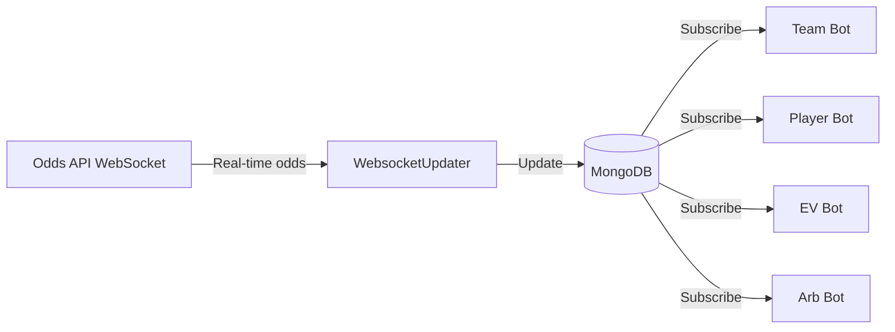
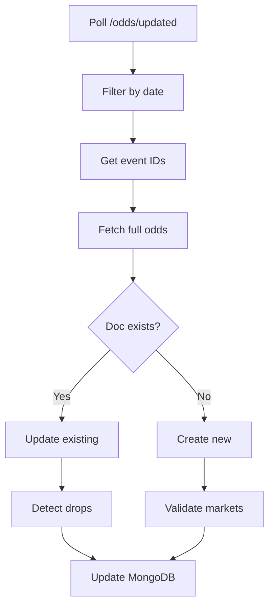

## Overview

PROPPR's data services run continuously in the background to collect, process, and store betting data. These services power the alert bots by providing real-time odds, historical statistics, and bet grading.

<Note>
All data services are independent Python processes that communicate via MongoDB. They can be deployed separately and scaled independently.
</Note>

---

## WebsocketUpdater

### Purpose
Receives real-time odds updates via WebSocket streams and updates MongoDB documents with sub-second latency.

### Architecture

```python
# Source: WebsocketUpdater/core/websocket_updater.py

class UnifiedWebSocketService:
    """Manages WebSocket connections to Odds API"""
    
    def __init__(self, api_key: str):
        self.api_key = api_key
        self.connections = {}
        
    def connect(self, feed: str):
        """Connect to WebSocket feed"""
        url = f"wss://api.odds-api.io/v3/ws/{feed}"
        ws = websocket.WebSocketApp(
            url,
            on_message=self.on_message,
            on_error=self.on_error,
            on_close=self.on_close
        )
        ws.run_forever()
```

### Data Flow



### Collections Updated

#### team_odds
**Format:**
```json
{
  "id": 61234567,
  "home": "Arsenal",
  "away": "Chelsea",
  "league": "Premier League",
  "country": "England",
  "date": "2026-03-15T15:00:00Z",
  "bookmakers": {
    "Bet365": [
      {
        "name": "Team Corners Home",
        "odds": [
          {
            "over": 2.10,
            "under": 1.75,
            "hdp": 5.5,
            "updatedAt": "2026-03-15T14:55:23Z"
          }
        ]
      }
    ],
    "M88": [...],
    "FB Sports": [...]
  },
  "last_updated": "2026-03-15T14:55:23Z",
  "source": "websocket"
}
```

#### player_odds
**Format:**
```json
{
  "id": 61234567,
  "home": "Arsenal",
  "away": "Chelsea",
  "markets_normalized": {
    "Bet365": [
      {
        "name": "Player Shots On Target",
        "players": [
          {
            "player_name": "Bukayo Saka",
            "position": "RW",
            "odds": [
              {
                "over": 2.40,
                "under": 1.60,
                "hdp": 1.5,
                "updatedAt": "2026-03-15T14:55:23Z"
              }
            ]
          }
        ]
      }
    ]
  },
  "source": "websocket"
}
```

#### all_value_bets
**Format:**
```json
{
  "event_id": 61234567,
  "event_name": "Arsenal vs Chelsea",
  "league": "England - Premier League",
  "market_name": "Totals",
  "bet_side": "over",
  "market_hdp": 2.5,
  "bookmaker": "Bet365",
  "bookmaker_odds": {
    "over": 2.10,
    "under": 1.75
  },
  "sharp_source": "M88",
  "sharp_odds": {
    "over": 1.93,
    "under": 1.90
  },
  "expected_value": 108.8,
  "created_at": "2026-03-15T14:55:23Z",
  "expires_at": "2026-03-15T15:05:00Z",
  "source": "websocket"
}
```

### Update Strategy

<AccordionGroup>
  <Accordion title="Odds Drop Detection">
    WebSocket monitors for odds drops >= 0.05% and logs them to the `updates` array:
    
    ```python
    # Detect drops
    if new_odds < existing_odds * 0.9995:  # 0.05% threshold
        update = {
            "timestamp": datetime.now(timezone.utc),
            "bookmaker": "Bet365",
            "market": "Team Corners Home",
            "side": "over",
            "old_odds": existing_odds,
            "new_odds": new_odds,
            "drop_pct": ((existing_odds - new_odds) / existing_odds) * 100
        }
        collection.update_one(
            {"id": fixture_id},
            {"$push": {"updates": update}}
        )
    ```
  </Accordion>

  <Accordion title="Granular Timestamps">
    Each odds entry receives its own timestamp for accurate staleness detection:
    
    ```python
    def apply_granular_timestamps(markets: List[Dict]) -> List[Dict]:
        """Add per-entry timestamps for Exchange Bot staleness check"""
        now = datetime.now(timezone.utc).isoformat()
        for market in markets:
            for odds_entry in market.get('odds', []):
                odds_entry['updatedAt'] = now
        return markets
    ```
  </Accordion>

  <Accordion title="Bookmaker Consolidation">
    Consolidates duplicate bookmakers (e.g., "Bet365" and "Bet365 (no latency)"):
    
    ```python
    def consolidate_bet365(bookmakers: Dict) -> Dict:
        """Merge Bet365 variants into single entry"""
        consolidated = {}
        bet365_markets = []
        
        if 'Bet365' in bookmakers:
            bet365_markets.extend(bookmakers['Bet365'])
        if 'Bet365 (no latency)' in bookmakers:
            bet365_markets.extend(bookmakers['Bet365 (no latency)'])
        
        if bet365_markets:
            consolidated['Bet365'] = bet365_markets
        
        # Copy other bookmakers
        for bm_name, markets in bookmakers.items():
            if bm_name not in ['Bet365', 'Bet365 (no latency)']:
                consolidated[bm_name] = markets
        
        return consolidated
    ```
  </Accordion>
</AccordionGroup>

### Performance Metrics

- **Latency**: ~100-500ms from odds change to database update
- **Throughput**: ~500 updates/second during peak (live games)
- **Uptime**: 99.9% (auto-reconnect on disconnect)
- **Memory**: ~200MB RAM per WebSocket connection

### Configuration

**Environment Variables:**
```bash
MONGO_URI=mongodb://localhost:27017
MONGO_DATABASE=proppr
ODDS_API_KEY=your_api_key_here
WS_RECONNECT_DELAY=5  # seconds
WS_PING_INTERVAL=30  # seconds
```

**Startup:**
```bash
python -m PROPPR.WebsocketUpdater.runners.run_websocket_updater
```

---

## UnifiedAPIPoller

### Purpose  
Polls REST API every 60 seconds for odds updates on fixtures without WebSocket coverage. Manages shared 5000 req/hour API limit.

### Architecture

```python
# Source: UnifiedAPIPoller/core/unified_poller.py

class UnifiedAPIPoller:
    """Polls Odds API REST endpoints for odds updates"""
    
    def __init__(self):
        self.api_key = get_odds_api_key()
        self.client = MongoClient(MONGO_URI)
        self.db = self.client[MONGO_DATABASE]
        self.team_odds = self.db['team_odds']
        self.player_odds = self.db['player_odds']
        
    def fetch_updated_odds(self, lookback_seconds: int = 50):
        """Fetch odds updated in last 50 seconds"""
        since = int(time.time()) - lookback_seconds
        url = f"https://api.odds-api.io/v3/odds/updated?apiKey={self.api_key}&since={since}"
        response = requests.get(url, timeout=30)
        return response.json()
```

### Polling Strategy

#### Frequency
- **Main loop**: 60 seconds
- **Lookback window**: 50 seconds (safe margin under 60s API limit)
- **Rate limiting**: Shared tracker across all services

#### Endpoint Selection

<Tabs>
  <Tab title="/odds/updated">
    **Use case**: Incremental updates for existing fixtures  
    **Frequency**: Every 60 seconds  
    **Cost**: 1 API request  
    **Returns**: Only fixtures with odds changes in last 50s
    
    ```bash
    GET /v3/odds/updated?apiKey={key}&since=1709571600&bookmaker=Bet365
    ```
  </Tab>
  
  <Tab title="/odds/multi">
    **Use case**: Fetch full odds for specific fixtures  
    **Frequency**: On-demand (when new fixtures detected)  
    **Cost**: 1 API request per 10 fixtures  
    **Returns**: Complete odds data for requested fixtures
    
    ```bash
    GET /v3/odds/multi?apiKey={key}&eventIds=61234567,61234568&bookmakers=Bet365,M88
    ```
  </Tab>
</Tabs>

### Data Processing Pipeline



### Collections Updated

Same collections as WebsocketUpdater (`team_odds`, `player_odds`), but with source label:

```json
{
  "source": "api_poller",
  "last_api_sync": "2026-03-15T14:55:00Z"
}
```

### Rate Limiting

Shared global rate limiter prevents exceeding 5000 req/hour:

```python
# Source: SharedServices/tracking/request_tracker.py

class GlobalRequestTracker:
    """Shared rate limiter across all services"""
    
    def __init__(self, max_requests: int = 5000, window_hours: int = 1):
        self.max_requests = max_requests
        self.window = window_hours * 3600
        self.requests = []  # List of timestamps
        
    def can_make_request(self) -> bool:
        """Check if request would exceed limit"""
        now = time.time()
        # Remove requests outside window
        self.requests = [ts for ts in self.requests if now - ts < self.window]
        return len(self.requests) < self.max_requests
        
    def record_request(self):
        """Record a new request"""
        self.requests.append(time.time())
```

**Usage across services:**
- WebsocketUpdater: ~100 req/hour (fallback API calls)
- UnifiedAPIPoller: ~1000 req/hour (main polling)
- EV Bot: ~3000 req/hour (value bet discovery)
- Other bots: ~900 req/hour (on-demand lookups)

### Configuration

**Environment Variables:**
```bash
POLL_INTERVAL=60  # seconds between polls
LOOKBACK_SECONDS=50  # how far back to check for updates
BATCH_SIZE=10  # fixtures per /odds/multi request
MAX_API_REQUESTS_PER_HOUR=5000
```

**Startup:**
```bash
python -m PROPPR.UnifiedAPIPoller.runners.run_unified_poller
```

---

## StatsUpdateFM

### Purpose
Daily statistics pipeline that fetches team and player performance data from FotMob API to power predictive models.

### Architecture

```python
# Source: StatsUpdateFM/core/pipeline/stats_update.py

class StatsPipeline:
    """Orchestrates daily stats update from FotMob"""
    
    def run_daily_update(self):
        """Execute full stats pipeline"""
        leagues = self.get_active_leagues()
        
        for league in leagues:
            fixtures = self.get_league_fixtures(league)
            
            for fixture in fixtures:
                # Fetch team stats
                team_stats = self.fetch_team_stats(fixture)
                self.store_team_stats(team_stats)
                
                # Fetch player stats
                player_stats = self.fetch_player_stats(fixture)
                self.store_player_stats(player_stats)
```

### Data Collection

#### FotMob API Integration

<AccordionGroup>
  <Accordion title="Team Statistics">
    Collected per team per fixture:
    
    - **Basic**: Goals, corners, cards, shots, fouls, offsides, tackles
    - **Advanced**: xG, possession, pass completion, duels won
    - **Time-split**: First half, second half, full match
    - **Historical**: Last 5, last 10, season averages
    
    ```python
    team_stats = {
        'team_id': 9825,
        'team_name': 'Arsenal',
        'league': 'Premier League',
        'last_5_matches': [
            {
                'opponent': 'Chelsea',
                'result': 'W',
                'goals': 3,
                'corners': 6,
                'cards': 2,
                'shots': 15,
                'shots_on_target': 7,
                'xg': 2.3
            },
            # ... 4 more matches
        ],
        'averages': {
            'goals_per_match': 2.1,
            'corners_per_match': 5.8,
            'cards_per_match': 1.9,
            'xg_per_match': 1.95
        }
    }
    ```
  </Accordion>

  <Accordion title="Player Statistics">
    Collected per player per fixture:
    
    - **Basic**: Goals, assists, shots, fouls, passes, tackles
    - **Advanced**: xG, xA, key passes, dribbles, duels
    - **Positional**: Position-specific stats (CB: tackles, FW: shots)
    - **Form**: Last 5 matches, season totals
    
    ```python
    player_stats = {
        'player_id': 543210,
        'player_name': 'Bukayo Saka',
        'team': 'Arsenal',
        'position': 'RW',
        'last_5_matches': [
            {
                'opponent': 'Chelsea',
                'minutes': 90,
                'goals': 1,
                'assists': 1,
                'shots': 4,
                'shots_on_target': 3,
                'xg': 0.8,
                'xa': 0.3
            },
            # ... 4 more matches
        ],
        'season_stats': {
            'appearances': 28,
            'goals': 12,
            'assists': 8,
            'minutes_per_goal': 180,
            'shots_on_target_per_90': 2.4
        }
    }
    ```
  </Accordion>
</AccordionGroup>

### MongoDB Schema

#### predicted_lines Collection

**Purpose**: Store predicted lines for team markets based on historical averages

```json
{
  "_id": ObjectId("..."),
  "fixture_id": 61234567,
  "home_team": "Arsenal",
  "away_team": "Chelsea",
  "league": "Premier League",
  "date": "2026-03-15T15:00:00Z",
  
  "predicted_lines_last10": {
    "Goals": {"home": 1.8, "away": 1.2},
    "Corners": {"home": 5.6, "away": 4.8},
    "Yellow Cards": {"home": 1.9, "away": 2.1},
    "Shots": {"home": 14.2, "away": 11.3},
    "Shots On Target": {"home": 5.1, "away": 4.2}
  },
  
  "home_averages_last10": {
    "GOALS": 2.1,
    "CORNERS": 6.2,
    "YELLOW_CARDS": 1.8,
    "SHOTS": 15.3,
    "SHOTS_ON_TARGET": 5.7
  },
  
  "away_averages_last10": {
    "GOALS": 1.5,
    "CORNERS": 5.1,
    "YELLOW_CARDS": 2.3,
    "SHOTS": 12.1,
    "SHOTS_ON_TARGET": 4.6
  },
  
  "1st_half_predicted_lines_last10": { /* Same structure */ },
  "2nd_half_predicted_lines_last10": { /* Same structure */ },
  
  "updated_at": "2026-03-14T10:00:00Z"
}
```

#### player_projections Collection

**Purpose**: Store player-level projections for prop markets

```json
{
  "_id": ObjectId("..."),
  "fixture_id": 61234567,
  "player_id": 543210,
  "player_name": "Bukayo Saka",
  "team": "Arsenal",
  "position": "RW",
  
  "projected_goals": 0.68,
  "projected_assists": 0.42,
  "projected_shots": 3.2,
  "projected_shots_on_target": 1.8,
  
  "avg_stats_last5": {
    "GOALS": 0.8,
    "ASSISTS": 0.6,
    "SHOTS": 3.8,
    "SHOTS_ON_TARGET": 2.4,
    "FOULS_COMMITTED": 1.2
  },
  
  "form": [1, 1, 0, 1, 1],  // Last 5 matches (1=good, 0=bad)
  "updated_at": "2026-03-14T10:00:00Z"
}
```

### Update Schedule

- **Daily**: 06:00 UTC (bulk update all leagues)
- **Pre-match**: 2 hours before kickoff (refresh fixture-specific stats)
- **Post-match**: 30 minutes after full-time (final stats + grade bets)

### Performance

- **Duration**: ~45 minutes for full daily update (50+ leagues)
- **API calls**: ~2000 requests/day to FotMob
- **Storage**: ~500MB/day added to MongoDB

### Configuration

```bash
python -m PROPPR.StatsUpdateFM.runners.run_stats_pipeline
```

---

## PropprGrader

### Purpose
Grades tracked bets after fixtures finish using FotMob match data. Handles win/loss/refund determination and P&L calculation.

### Architecture

```python
# Source: SharedServices/grading/processors/immediate_bet_grader.py

class ImmediateBetGrader:
    """Grades bets using FotMob fixture data"""
    
    def __init__(self, bot_type: str = 'player'):
        self.bot_type = bot_type
        self.fotmob = get_fotmob_service()
        
    def grade_bet(self, bet_doc: Dict, fixture_data: Dict) -> Dict:
        """Grade a single bet and return updated doc"""
        # Check fixture finished
        if not self.is_fixture_finished(fixture_data):
            return bet_doc
            
        # Get actual stat value
        actual_value = self.get_stat_value(fixture_data, bet_doc)
        
        # Determine result
        result = self.determine_result(
            actual_value,
            bet_doc['threshold'],
            bet_doc['direction']
        )
        
        # Calculate returns
        return self.calculate_returns(bet_doc, result)
```

### Grading Logic

<AccordionGroup>
  <Accordion title="Win Conditions">
    **Over bets**: Actual value > Threshold  
    **Under bets**: Actual value < Threshold
    
    ```python
    def determine_result(actual: float, threshold: float, direction: str):
        if direction == 'over':
            if actual > threshold:
                return 'won'
            elif actual == threshold:
                return 'refund'  # Push on exact
            else:
                return 'lost'
        else:  # under
            if actual < threshold:
                return 'won'
            elif actual == threshold:
                return 'refund'
            else:
                return 'lost'
    ```
  </Accordion>

  <Accordion title="Player DNP (Did Not Play)">
    If player is not in squad/lineup, bet is refunded:
    
    ```python
    def check_player_in_lineup(fixture_data: Dict, player_name: str) -> bool:
        """Check if player was in squad"""
        lineup = fixture_data.get('content', {}).get('lineup', {})
        
        # Check starters and bench
        for side in ['homeTeam', 'awayTeam']:
            starters = lineup.get(side, {}).get('starters', [])
            bench = lineup.get(side, {}).get('bench', [])
            
            all_players = starters + bench
            for player in all_players:
                if player_name.lower() in player.get('name', '').lower():
                    return True
        
        return False  # Not in squad = refund
    ```
  </Accordion>

  <Accordion title="Profit/Loss Calculation">
    ```python
    def calculate_returns(bet_doc: Dict, result: str) -> Dict:
        stake = bet_doc['actual_stake']
        odds = bet_doc['odds']
        
        if result == 'won':
            returns = stake * odds
            profit = returns - stake
        elif result == 'refund':
            returns = stake
            profit = 0.0
        else:  # lost
            returns = 0.0
            profit = -stake
        
        bet_doc['status'] = result
        bet_doc['returns'] = returns
        bet_doc['profit_loss'] = profit
        bet_doc['settled_at'] = datetime.now(timezone.utc)
        
        return bet_doc
    ```
  </Accordion>
</AccordionGroup>

### FotMob Data Mapping

#### Team Stats Extraction

```python
def get_team_stat(fixture_data: Dict, team_name: str, stat_type: str) -> float:
    """Extract team stat from FotMob fixture data"""
    
    # Map stat types to FotMob keys
    stat_mapping = {
        'goals': 'GOALS',
        'corners': 'CORNERS',
        'yellow_cards': 'YELLOW_CARDS',
        'shots': 'SHOTS',
        'shots_on_target': 'SHOTS_ON_TARGET',
        'fouls': 'FOULS_COMMITTED'
    }
    
    fotmob_key = stat_mapping.get(stat_type)
    
    # Get team stats from content.stats
    stats = fixture_data.get('content', {}).get('stats', {})
    
    # Determine if home or away team
    home_team = fixture_data.get('header', {}).get('teams', [])[0].get('name')
    is_home = (team_name.lower() in home_team.lower())
    
    team_stats = stats.get('home' if is_home else 'away', {})
    return float(team_stats.get(fotmob_key, 0))
```

#### Player Stats Extraction

```python
def get_player_stat(fixture_data: Dict, player_name: str, stat_type: str) -> float:
    """Extract player stat from FotMob fixture data"""
    
    # Check both teams
    for side in ['homeTeam', 'awayTeam']:
        players = fixture_data.get('content', {}).get('lineup', {}).get(side, {}).get('players', [])
        
        for player in players:
            p_name = player.get('name', '')
            if player_name.lower() in p_name.lower():
                # Get player stats
                stats = player.get('stats', {})
                return float(stats.get(stat_type, 0))
    
    return 0.0  # Player not found
```

### Grading Schedule

- **Immediate**: Grade bets for fixtures that finished before tracking
- **Post-match**: Grade all bets 30 minutes after FT whistle
- **Delayed**: Re-check fixtures with missing stats after 2 hours

### Collections Updated

- `team_tracked_bets`
- `player_tracked_bets` 
- `horse_tracked_bets`
- `overtime_placed_bets`

**Updated fields:**
```json
{
  "status": "won",  // won/lost/refund
  "actual_value": 3.0,
  "returns": 210.0,
  "profit_loss": 110.0,
  "settled_at": "2026-03-15T17:30:00Z",
  "_graded_immediately": true
}
```

### Configuration

```bash
# Run grading scheduler (checks every 5 minutes)
python -m PROPPR.SharedServices.grading.runners.run_grading_scheduler
```

---

## Service Comparison

| Feature | WebsocketUpdater | UnifiedAPIPoller | StatsUpdateFM | PropprGrader |
|---------|-----------------|------------------|---------------|-------------|
| **Real-time** | ✅ Yes (&lt;1s) | ❌ No (60s lag) | ❌ No (daily) | ❌ No (post-match) |
| **Critical path** | ✅ Yes | ✅ Yes | ❌ No | ❌ No |
| **API calls/hour** | ~100 | ~1000 | ~83 (2000/day) | ~50 |
| **Collections** | 3 (team/player/ev) | 2 (team/player) | 2 (predicted/projections) | 4 (tracking) |
| **Deployment** | Required | Required | Optional | Optional |
| **Restart impact** | High (miss updates) | Medium (60s gap) | Low (daily catchup) | None (post-match) |

---

## Deployment

### Docker Compose

```yaml
version: '3.8'

services:
  websocket-updater:
    build: ./WebsocketUpdater
    environment:
      - MONGO_URI=mongodb://mongo:27017
      - ODDS_API_KEY=${ODDS_API_KEY}
    restart: always
    depends_on:
      - mongo

  unified-poller:
    build: ./UnifiedAPIPoller
    environment:
      - MONGO_URI=mongodb://mongo:27017
      - ODDS_API_KEY=${ODDS_API_KEY}
      - POLL_INTERVAL=60
    restart: always
    depends_on:
      - mongo

  stats-pipeline:
    build: ./StatsUpdateFM
    environment:
      - MONGO_URI=mongodb://mongo:27017
    restart: always
    depends_on:
      - mongo

  grader:
    build: ./SharedServices
    command: python -m grading.runners.run_grading_scheduler
    environment:
      - MONGO_URI=mongodb://mongo:27017
    restart: always
    depends_on:
      - mongo

  mongo:
    image: mongo:6.0
    volumes:
      - mongo-data:/data/db
    ports:
      - "27017:27017"

volumes:
  mongo-data:
```

### PM2 (Alternative)

```bash
# Install PM2
npm install -g pm2

# Start services
pm2 start ecosystem.config.js

# ecosystem.config.js
module.exports = {
  apps: [
    {
      name: 'websocket-updater',
      script: 'python',
      args: '-m PROPPR.WebsocketUpdater.runners.run_websocket_updater',
      cwd: '/opt/proppr',
      autorestart: true,
      max_memory_restart: '500M'
    },
    {
      name: 'unified-poller',
      script: 'python',
      args: '-m PROPPR.UnifiedAPIPoller.runners.run_unified_poller',
      cwd: '/opt/proppr',
      autorestart: true,
      max_memory_restart: '300M'
    },
    {
      name: 'stats-pipeline',
      script: 'python',
      args: '-m PROPPR.StatsUpdateFM.runners.run_stats_pipeline',
      cwd: '/opt/proppr',
      autorestart: true,
      max_memory_restart: '400M'
    },
    {
      name: 'grader',
      script: 'python',
      args: '-m PROPPR.SharedServices.grading.runners.run_grading_scheduler',
      cwd: '/opt/proppr',
      autorestart: true,
      max_memory_restart: '200M'
    }
  ]
}
```

---

## Monitoring

### Health Checks

Each service exposes health metrics:

```python
# Health check endpoint (Flask)
from flask import Flask, jsonify

app = Flask(__name__)

@app.route('/health')
def health():
    return jsonify({
        'status': 'healthy',
        'uptime': get_uptime(),
        'last_update': last_update_time,
        'queue_size': get_queue_size()
    })
```

### Logging

All services log to:
- **Console**: Info level
- **File**: Debug level (`/var/log/proppr-*.log`)
- **MongoDB**: Error level (stored in `service_logs` collection)

### Alerting

Critical alerts sent via:
- Telegram admin notifications
- Email (for extended downtime)
- PagerDuty (optional)

---

## Next Steps

<Card title="Alert Bots" icon="bell" href="/services/alert-bots">
  Learn how alert bots consume this data
</Card>
