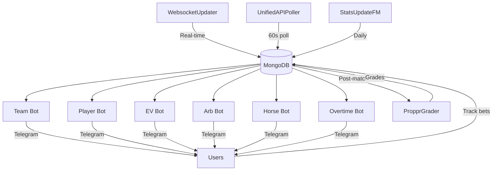

## System Architecture

PROPPR uses a microservices architecture with six core alert bots and four data services. Each service is independently deployable and communicates through a shared MongoDB database.

<CardGroup cols={2}>
  <Card title="Alert Bots" icon="bell" href="#alert-bots">
    Six specialized Telegram bots for different betting markets
  </Card>
  <Card title="Data Services" icon="database" href="#data-services">
    Four background services for real-time odds and statistics
  </Card>
</CardGroup>

## Alert Bots

### Team Bot
**Markets**: Team totals (goals, corners, cards, shots, fouls, tackles, offsides)  
**Collection**: `team_odds`  
**Users**: 1000+  

Monitors team-level statistical markets across 50+ football leagues. Sends alerts when sharp bookmaker odds (M88, FB Sports) suggest value.

### Player Bot
**Markets**: Player props (goals, assists, shots, fouls, passes, tackles)  
**Collection**: `player_odds`  
**Users**: 800+

Tracks player-specific markets with position-aware filtering and lineup monitoring.

### EV Bot
**Markets**: All sports (ML, spread, totals, props)  
**Collection**: `all_value_bets`  
**Users**: 2000+

Cross-sport value betting system comparing recreational bookmakers (Bet365, Polymarket) against sharp odds.

### Arb Bot
**Markets**: Arbitrage opportunities across all sports  
**Collection**: `arbitrage_bets`  
**Users**: 500+

Detects risk-free profit opportunities across bookmakers, including exchange lay betting.

### Horse Bot
**Markets**: UK horse racing WIN/PLACE  
**Collection**: `horse_racing_bets`  
**Users**: 150+

Specialized bot for UK horse racing with night-before alerts and BSP targeting.

### Overtime Bot
**Markets**: Crypto sportsbook (Overtime Markets + Polymarket)  
**Collection**: `overtime_odds`  
**Users**: 200+

On-chain sports betting with automated wallet management and value detection.

## Data Services

### WebsocketUpdater
**Function**: Real-time odds updates  
**Update Frequency**: Sub-second  
**Collections Updated**: All odds collections

Receives WebSocket streams from Odds API and updates documents in real-time. Critical for catching line movements before they disappear.

### UnifiedAPIPoller
**Function**: Polling-based odds updates  
**Poll Interval**: 60 seconds  
**Collections Updated**: `team_odds`, `player_odds`

Polls REST API every minute for fixtures that don't have WebSocket coverage. Manages shared 5000 req/hour API limit.

### StatsUpdateFM
**Function**: Historical statistics pipeline  
**Update Frequency**: Daily + pre-match  
**Collections Updated**: `predicted_lines`, `player_stats`

Fetches team and player statistics from FotMob API to power predictive models and historical analysis.

### PropprGrader
**Function**: Bet result grading  
**Grading Method**: FotMob API  
**Collections Updated**: Tracking collections

Grades tracked bets after fixtures finish using FotMob match data. Handles player DNP (Did Not Play) refunds.

## Service Comparison

| Service | Type | Real-time | API Usage | Critical Path |
|---------|------|-----------|-----------|---------------|
| WebsocketUpdater | Data | ✅ Yes | Low | Yes |
| UnifiedAPIPoller | Data | ❌ No (60s) | High | Yes |
| StatsUpdateFM | Data | ❌ No (daily) | Medium | No |
| PropprGrader | Data | ❌ No (post-match) | Low | No |
| Team Bot | Alert | ✅ Yes | None | Yes |
| Player Bot | Alert | ✅ Yes | None | Yes |
| EV Bot | Alert | ✅ Yes | High | Yes |
| Arb Bot | Alert | ✅ Yes | None | Yes |
| Horse Bot | Alert | ⚠️ Scheduled | None | No |
| Overtime Bot | Alert | ✅ Yes | Medium | Yes |

## When to Use Each Service

### For Real-Time Alerts
**Use**: Team Bot, Player Bot, EV Bot, Arb Bot  
**Why**: Sub-second WebSocket updates catch fleeting value  
**Example**: Bet365 drops team corners from 2.00→1.90 while M88 stays at 2.10

### For Pre-Match Research
**Use**: StatsUpdateFM data via bots  
**Why**: Historical trends inform pre-match value  
**Example**: Team averages 5.2 corners/match in last 10 games

### For Post-Match Analysis
**Use**: PropprGrader + tracking collections  
**Why**: Accurate P&L tracking and performance metrics  
**Example**: Grade all tracked bets after matches finish

### For Crypto Betting
**Use**: Overtime Bot exclusively  
**Why**: On-chain betting requires specialized wallet management  
**Example**: Auto-place bets on Overtime Markets with EV+ detection

## Architecture Diagram

## Technology Stack

- **Language**: Python 3.11+
- **Database**: MongoDB 6.0+
- **Message Queue**: Telegram Bot API
- **APIs**: Odds API, FotMob, Overtime Markets
- **Deployment**: Docker + PM2

## Next Steps

<CardGroup cols={2}>
  <Card title="Alert Bots" icon="bell" href="/services/alert-bots">
    Detailed documentation for all 6 alert bots
  </Card>
  <Card title="Data Services" icon="database" href="/services/data-services">
    Technical deep-dive into data collection services
  </Card>
</CardGroup>
